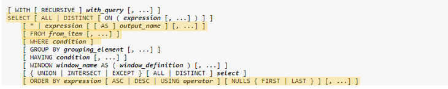
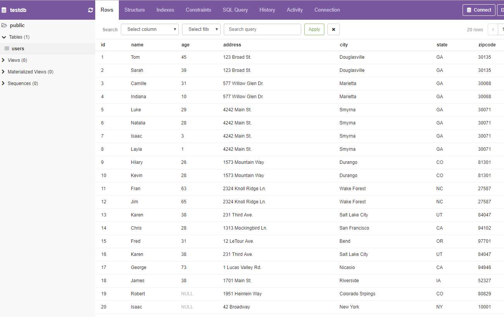
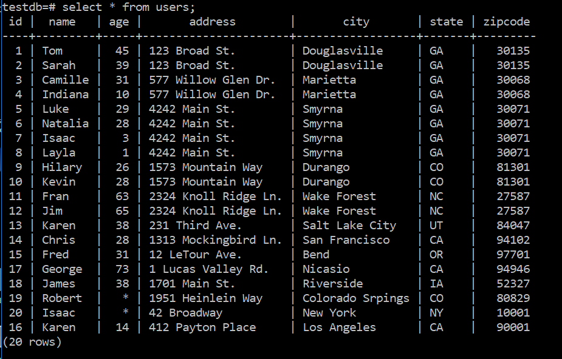
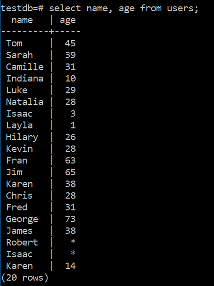
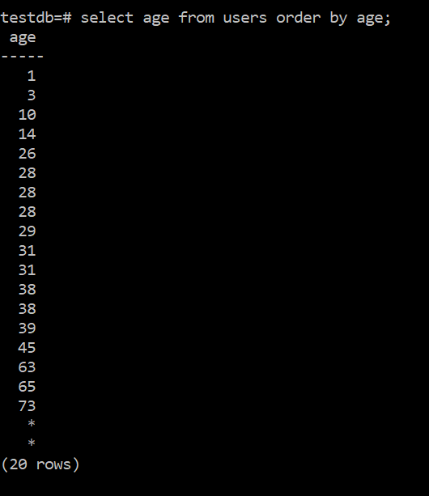

# Introduction to SELECT

## Overview

SELECT is the basic tool to get data from a SQL database. The full syntax of SELECT is:


Fortunately, we'll only be starting with a subset of this. In particular, we're going to use this part:



## Setup

The first thing is to create a database and some data that we can play with. Run the provided
migration script to create the database 'testdb' and populate it with a 'users' table. (If you already
have a testdb database either drop it or rename the database in the script.) From psql you can run the command

```\i <path to script>```

Using pgweb, we can see all of the information in the table.



But we really need to learn how to access this data programmaticly.

## The SELECT Statement

The SELECT statement is probably the most used tool in the SQL toolbox. As you saw above, it has a rich set of
options and mastering these can make you a very valuable member of a development team. You can also write queries
that take forever to run, so writing efficient queries is also very important. We're not going to worry about
efficiency just yet however.

A SELECT query always returns a table. Even if there is only one field and one line, the structure that is returned
is a table. Let's start with a basic query to get the information from the table.

```SELECT * FROM users;```



<details><summary>
	Displaying NULL as *
</summary><p>

Aside: You'll notice that I have a '*' where there's a NULL in the data. You can do that by running the command

```\pset null *```

in psql.

</p></details>

One important point is that the order in which you receive the rows is random-ish. There's no guarantee of a particular
order unless you specify it. (It's not truly random. The server has an algorithm that it uses to retrieve and format the
data. But it might not be the order that we expected and it might be a different order tomorrow depending on what happened
overnight or what's happening now.)

So let's dissect the SELECT statement that I used.

```SELECT * FROM users;```

SELECT - the keyword that tells the server that we're doing a SELECT statement. (But I bet you'd already figured that out.)<br>
\* - Get all of the fields for the relevant table.<br>
FROM - Another keyword that tells the command parser that the table name is next.<br>
users - The name of the table that we're pulling the information from.

Instead of user '\*', we could have listed the fields that we are interested in. And they don't have to be in the original order.

```SELECT name, age FROM users;```



You'll notice that you can list multiple fields with a comma separator.

As was said before, the data will come out in a random order from the SELECT statement, but we can control the order with the
\'ORDER BY\' clause. For example

```SELECT age FROM users ORDER BY age;```


