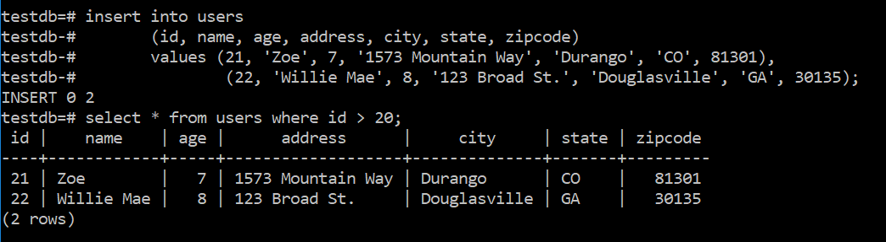

# INSERT, UPDATE, and DELETE

## Overview

In the previous module you learned to fetch records from a table using ```SELECT```. Now you'll
learn how to insert new records (rows), change existing records, and delete existing rows.

## Setup

We'll use the users table that was created for the last module so no additional setup is required.

## The INSERT Statement

The ```INSERT``` command inserts new records into an existing table. The base syntax is this:

```SQL
INSERT INTO table_name [ ( column_name [, ...] ) ]
	VALUES ( { expression | DEFAULT } [, ...] ) [, ...]
```

Let's take a look at an example.

```SQL
INSERT INTO users
	(id, name, age, address, city, state, zipcode)
	VALUES (21, 'Zoe', 7, '1573 Mountain Way', 'Durango', 'CO', 81301),
		(22, 'Willie Mae', 8, '123 Broad St.', 'Douglasville', 'GA', 30135);
```



### Exercises

## The UPDATE Statement

### Exercises

## The DELETE Statement

### Exercises
