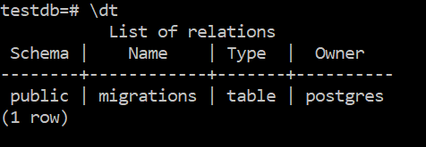

# Database/Schema Migration

## Overview

Consider the following circumstance. You are working on a project that requires a database and you decide
to collaborate with a partner. You have both already created databases and populated them with tables and
data, but now need to merge the two databases into one. Moving the schema and data from one database to
the other is known as **database or schema migration**. Another example might be if two businesses merge
(or one acquires another) and there is a need to merge the corporate databases.

## Note on primary keys and the serial data type

To this point, we've been creating our tables like this:

```SQL
CREATE TABLE users (
	id INT PRIMARY KEY NOT NULL
	...
	);
```

But there's actually a better way. You don't really want to have to keep track of what the next number
is for your key. The answer to this is to declare id a ```SERIAL``` type. ```SERIAL``` is an integer type and
automatically uses the next available integer (starting with 1) for the value. It is also automatically
```NOT NULL```. It isn't automatically a primary key so you still have to declare that. (So you can
use ```SERIAL``` for fields other than a primary key.)

```SQL
CREATE TABLE users (
	id SERIAL PRIMARY KEY
	...
	);
```

Now you don't have to include the id field in your ```INSERT``` statement.

```SQL
INSERT INTO users (name, ...)
	VALUES ('Fred', ...);
```

Or if you don't want to specify the fields, you can use ```DEFAULT```.

```SQL
INSERT INTO users
	(DEFAULT, 'Fred', ...);
```

Here's a quick example:


One thing to note is that if you delete a record, ```SERIAL``` will not reuse that integer so there's no
problem with duplicate keys.


## Setup

We'll be using the db-migrate service provided by Node.js. You already have Node installed so we just need
to install the appropriate packages. First create a directory named 'migration' in an appropriate place and
initialize package.json.

```npm init```

Now install the db-migrate package.

```npm install -g --save db-migrate```

And then install the PostgreSQL driver for db-migrate.

```npm install -g --save db-migrate-pg```

Last, we need to tell the system what database we'll be using (and how to access it.)

```
export DATABASE_URL=postgresql://<username>:<password>@localhost/testdb
export DATABASE_URL=postgresql://<username>@localhost/testdb
```

Where \<username\> is the user name that you created when you installed PostgreSQL. (The default was postgres and that's
probably what you used.) And \<password\> is the password that you created for that user name if you created a password.
Choose the appropriate version and put that into env.sh. Then ```source env.sh``` to get your environment set
up correctly.

## Usage

The first thing to understand is that there are **Up** migrations and **Down** migrations. An up migration
is what we'd typically think of as creating a new database, or adding tables to a database, or modifying
an existing database, etc. Basically this is the direction where we're creating or adding. A down migration
is just the opposite. Effectively a down migration is a scripted rollback of some set of database (SQL)
commands. Or more informally an "undo".

### Creating a migration

Let's start by creating a migration that will create the users tables that we've been using. (If you haven't
already ```DROP TABLE users```, you should do that now.) cd into the directory where you are going to create
the migration project.

```
db-migrate create add-users --sql-file
```

This will create a migrations directory (if it hasn't already been created) and will create the following files:

```
migrations/20171025160224-add-users.js
migrations/sqls/20171025160224-add-users-down.sql
migrations/sqls/20171025160224-add-users-up.sql
```

The first part of those file names are a date/time stamp from when the command was run so yours will be
different. We're not going to mess with the Javascript file. Instead we'll just put SQL commands into the
SQL files. Since we're going to create the users table, the SQL command looks like this:

```SQL
CREATE TABLE users (
	id serial primary key,
	name varchar not null,
	address varchar,
	city varchar,
	state varchar,
	zipcode int
	age int);
```

This will go into the file migrations/sqls/20171025160224-add-users-up.sql. And now we can run the db-migrate tool.

```
db-migrate up
```


And in psql we can see that the table has been created appropriately.


You can also see that a migrations table has been created. That's a table that is created automatically by
the db-migrate tool and keeps track of the migrations that have been performed.

And we should go ahead and add the appropriate command to the down migration script. Since we just created
the users table, all we need to do is drop the table. This will go into the file migrations/sqls/20171025160224-add-users-down.sql.

```SQL
DROP TABLE users;
```


And you can see that the users table has been dropped.



OK, I'm going to go ahead and run the up migration once again because we will want the users table. I'm
not going to show it because you already know that that looks like. But I am going to add a new migration file
to populate the users table.

```
db-migrate create populate-users --sql-file
```

This creates the files:

```
migrations/20171025160524-populate-users.js
migrations/sqls/20171025160524-populate-users-down.sql
migrations/sqls/20171025160524-populate-users-up.sql
```

And I'll add these commands to the up migration SQL file. I could have done all of this in one command but want to demonstrate
multiple commands in the migration file.

```SQL
INSERT INTO users VALUES (DEFAULT, 'Tom', '123 Broad St.', 'Douglasville', 'GA', 30135, 45);
INSERT INTO users VALUES (DEFAULT, 'Sarah', '123 Broad St.', 'Douglasville', 'GA', 30135, 39);
INSERT INTO users VALUES (DEFAULT, 'Camille', '577 Willow Glen Dr.', 'Marietta', 'GA', 30068, 31);
INSERT INTO users VALUES (DEFAULT, 'Indiana', '577 Willow Glen Dr.', 'Marietta', 'GA', 30068, 10);
INSERT INTO users VALUES (DEFAULT, 'Luke', '4242 Main St.', 'Smyrna', 'GA', 30071, 29);
INSERT INTO users VALUES (DEFAULT, 'Natalia', '4242 Main St.', 'Smyrna', 'GA', 30071, 28);
INSERT INTO users VALUES (DEFAULT, 'Isaac', '4242 Main St.', 'Smyrna', 'GA', 30071, 3);
INSERT INTO users VALUES (DEFAULT, 'Layla', '4242 Main St.', 'Smyrna', 'GA', 30071, 1);
INSERT INTO users VALUES (DEFAULT, 'Hilary', '1573 Mountain Way', 'Durango', 'CO', 81301, 26);
INSERT INTO users VALUES (DEFAULT, 'Kevin', '1573 Mountain Way', 'Durango', 'CO', 81301, 28);
INSERT INTO users VALUES (DEFAULT, 'Fran', '2324 Knoll Ridge Ln.', 'Wake Forest', 'NC', 27587, 63);
INSERT INTO users VALUES (DEFAULT, 'Jim', '2324 Knoll Ridge Ln.', 'Wake Forest', 'NC', 27587, 65);
INSERT INTO users VALUES (DEFAULT, 'Karen', '231 Third Ave.', 'Salt Lake City', 'UT', 84047, 38);
INSERT INTO users VALUES (DEFAULT, 'Chris', '1313 Mockingbird Ln.', 'San Francisco', 'CA', 94102, 28);
INSERT INTO users VALUES (DEFAULT, 'Fred', '12 LeTour Ave.', 'Bend', 'OR', 97701, 31);
INSERT INTO users VALUES (DEFAULT, 'Karen', '412 Payton Place', 'Los Angeles', 'CA', 90001, 14);
INSERT INTO users VALUES (DEFAULT, 'George', '1 Lucas Valley Rd.', 'Nicasio', 'CA', 94946, 73);
INSERT INTO users VALUES (DEFAULT, 'James', '1701 Main St.', 'Riverside', 'IA', 52327, 38);
INSERT INTO users VALUES (DEFAULT, 'Robert', '1951 Heinlein Way', 'Colorado Srpings', 'CO', 80829, NULL);
INSERT INTO users VALUES (DEFAULT, 'Isaac', '42 Broadway', 'New York', 'NY', 10001, NULL);
```

Once ```db-migrate up``` is run, notice that the new records are added. But ```db-migrate up``` runs **ALL**
of the up migrations. Well, what it really does is analyze the current state of the database and perform
the necessary commands to bring the database to the intended state once the migrate is complete. So while the
```db-migrate up``` command said to create the users table, that wasn't necessary since it was already created,
and the db-migrate command skipped that part.


The down migration for populate-users is to just truncate the table. As mentioned in an earlier lesson,

```SQL
TRUNCATE TABLE users;
```

deletes all of the records in a table.

### Exercises

1. Create and run all of the migration scripts listed above.

2. Create a new migration project and create the up and down migrations necessary to create and populate the tables
you have designed for the PokeBay project.

3. Run the migrations in .... to prepare for the next lesson.
