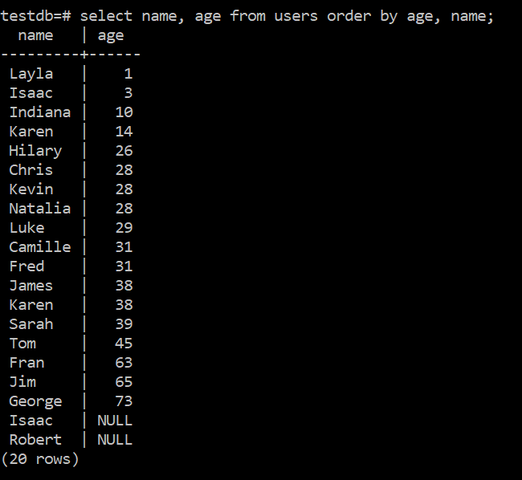

# Introduction to SELECT

## Overview

SELECT is the basic tool to read data from a SQL database. The full syntax of SELECT is:


Fortunately, we'll be starting with a subset of this. In particular, we're going to look at the
following clauses of the SELECT statement:
* LIMIT
* ORDER BY
* WHERE
* GROUP BY

## Setup

The first thing is to create a database and some data that we can play with. Run the provided
migration script to create the database 'testdb' and populate it with a 'users' table. (If you already
have a testdb database either drop it or rename the database in the script.) From psql you can run the command

```\i <path to script>```

Using pgweb, we can see all of the information in the table. Make sure to click on the table name and then
rows in pgweb.


But we really need to learn how to access this data programmaticly.

## The SELECT Statement

The SELECT statement is probably the most used tool in the SQL toolbox. As you saw above, it has a rich set of
options and mastering these can make you a very valuable member of a development team. You can also write queries
that take forever to run, so writing efficient queries is also very important. We're not going to worry about
efficiency just yet however.

A SELECT query always returns a table. Even if there is only one field and one record, the structure that is returned
is a table. Let's start with a basic query to get the information from the table.

```SELECT * FROM users;```


<details><summary>
	Displaying NULL as NULL
</summary><p>

Aside: You'll notice that I have a 'NULL' where there's a NULL in the data. You can do that by running the command

```\pset null NULL```

in psql. Normally psql displays NULL as a blank area which can be confusing.

</p></details>

One important point is that the order in which you receive the rows is random-ish. There's no guarantee of a particular
order unless you specify it. (It's not truly random. The server has an algorithm that it uses to retrieve and format the
data. But it might not be the order that we expected and it might be a different order tomorrow depending on what happened
overnight or what's happening now. For instance, the row with id 16 was originally between ids 15 and 17. But I modified
that row and it went to the bottom of the list in the next query.)

So let's dissect the SELECT statement that I used.

```SELECT * FROM users;```

* SELECT - the keyword that tells the server that we're doing a SELECT statement. (But I bet you'd already figured that out.)
* \* - Get all of the fields for the relevant table.
* FROM - Another keyword that tells the command parser that the table name is next.
* users - The name of the table that we're pulling the information from.
* ; - Because we never forget the semicolon.

Instead of '\*', we could have listed the fields that we are interested in. And they don't have to be in the original order.

```SELECT age, name FROM users;```


You'll notice that you can list multiple fields with a comma separator.

### Exercises

1. Write and execute a query that displays the name and city of each person in the table.
2. Write and execute a query that displays the states followed by the zipcode of each person in the table.

## The LIMIT Clause

While showing the 20 records of the table in our database isn't too bad, most production databases have tables
that have hundreds/thousands/millions of entries. So we need a way to limit the number of records in the output.
PostgreSQL has a LIMIT clause that allows us to do this. So if we wanted to just show the top 5 records of the table,
we'd do this:

```SELECT name, age FROM users LIMIT 5;```


One problem with this is that there's no discrimination on which records we get. This query just returned the \"first\"
5 records, but it was up to the server to determine which records those were. We'll see ways to help that in a minute.

NOTE: While most (all?) other products also have this functionality, it seems to be different in each one. For instance:
* Microsoft SQL Server uses TOP<br>
```SELECT TOP 5 age FROM users;```
* Oracle SQL uses ROWNUM<br>
```SELECT age FROM users WHERE ROWNUM <= 5;``` (We'll see WHERE in just a minute.)

### Exercises

1. Write and execute a query that displays 10 records of the user table.
2. Write and execute a query that displays 30 records of the user table. (Notice that this still works, but it only shows the 20
records that are actually in the table.)

## The ORDER BY Clause

As we said before, the records will come out in a random order from the SELECT statement, but we can control the order with the
\'ORDER BY\' clause. For example

```SELECT age FROM users ORDER BY age;```


This will sort the output by the specified field. You can also sort in descending order using this command.

```SELECT age FROM users ORDER BY age DESC;```

ASC is used for ascending if you need to specify that but ascending is typically the default.

You'll notice that the NULLs came out at the bottom. NULLs are a special case in SQL. Unlike in many programming
languages where a NULL is equivalent to zero, in SQL NULLs are their own entity. You can't compare a NULL to a
number or a string. And you can specify where you want the NULLs to appear in a sorted order.

```SELECT age FROM users ORDER BY age NULLS FIRST LIMIT 5;```


The various clauses must be in the proper order. See the big syntax diagram at the beginning for that order.
We can also put the NULLs last using ```NULLS LAST``` but that is also the default for an ascending list.

### Exercises

1. Write and execute a query that displays the name and age of the 5 oldest people in the table. Your output should look like this:



2. Write and execute a query that displays the name and age of the 5 youngest people in the table. Your output should look like this:


3. Write and execute a query that displays the name and age of the 6 youngest people in the table. Your output should look like this:


4. Did your last query correctly reflect all of the people in the list that should have been displayed? There are 3 people that are 28.

This leads to....

## The WHERE Clause

The WHERE clause allows us to filter the records on certain criteria. Let's look at that last exercise.

3. Write and execute a query that displays the name and age of the 6 youngest people in the table.

There were 3 entries with an age of 28. It's basically random which of the entries made it onto our list of 5.
But there's another what to constrain the data. Let's look at an example.

```SELECT name, age FROM users where age < 30 order by age;```


The new part, of course, is the WHERE clause. This allows us to filter the records on particular constraints. In this case
we got all records for people under the age of 30. You can also filter for strings.

```SELECT name, age, state FROM users where state='CA';```


This query reads all records whose state field is equal to 'CA'. And of course we can combine constraints in the usual way.
I'm going to start writing longer queries on multiple lines to make them easier to read.

```SELECT
	name,
	age, 
	state
FROM
	users
WHERE
	age < 30
	AND state = 'CA';```
