# INSERT, UPDATE, and DELETE

## Overview

In the previous module you learned to fetch records from a table using ```SELECT```. Now you'll
learn how to insert new records (rows), change existing records, and delete existing rows.

## Setup

We'll use the users table that was created for the last module so no additional setup is required.

## The INSERT Statement

The ```INSERT``` command inserts new records into an existing table. The base syntax is this:

```SQL
INSERT INTO table_name [ ( column_name [, ...] ) ]
	VALUES ( { expression | DEFAULT } [, ...] ) [, ...]
```

Let's take a look at an example.

```SQL
INSERT INTO users
	(id, name, age, address, city, state, zipcode)
	VALUES (21, 'Yogi', 59, '14 Picnic Basket Way', 'Jellystone Park', 'WY', 82190);
```

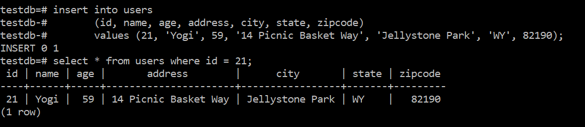

We've inserted one new record into the table. You can also insert multiple new records. For example:

```SQL
INSERT INTO users
	(id, name, age, address, city, state, zipcode)
	VALUES (22, 'Zoe', 7, '1573 Mountain Way', 'Durango', 'CO', 81301),
		(23, 'Willie Mae', 8, '123 Broad St.', 'Douglasville', 'GA', 30135);
```

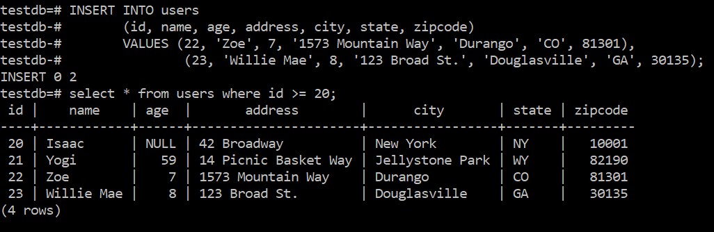

There is one thing to note. While I've listed the column names in the command, this is optional. It is only necessary if
you wish to rearrange the values in the command or insert a subset of the fields.

Let's look another example.

```SQL
INSERT INTO users
	(id, name)
	VALUES (24, 'Frank')
```


Notice that the fields that we didn't specify are filled in with the default value which is NULL. And
one last example.

```SQL
INSERT INTO users
	VALUES (DEFAULT, DEFAULT, DEFAULT, DEFAULT, DEFAULT, DEFAULT, DEFAULT);
```

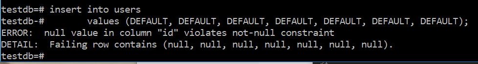

This didn't work since both the id and name field are required to not be NULL.

### Exercises

1. Insert the records (if you haven't already done so) that we created above.

2. Insert several of your own records into the users table.

## The UPDATE Statement

The ```UPDATE``` command modifies existing records in a table. The base syntax is this:

```SQL
UPDATE table_name
	SET { column_name = { expression | DEFAULT } |
			( column_name [, ...] ) = ( { expression | DEFAULT } [, ...] )
		} [, ...]
	[ WHERE condition ]
```

Let's take a look at an example.

```SQL
UPDATE users
	SET age = 103
	WHERE id = 24;
```

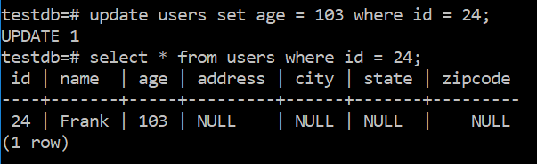

You have to be very careful with the ```UPDATE``` command as it will set the value for **EVERY** record
in the table if you don't specify a ```WHERE``` clause. I'm going to create a new column in our users table.

```SQL
ALTER TABLE users
	ADD COLUMN status varchar;
```

And then set the status for all of the records.

```SQL
UPDATE users
	SET status='active';
```

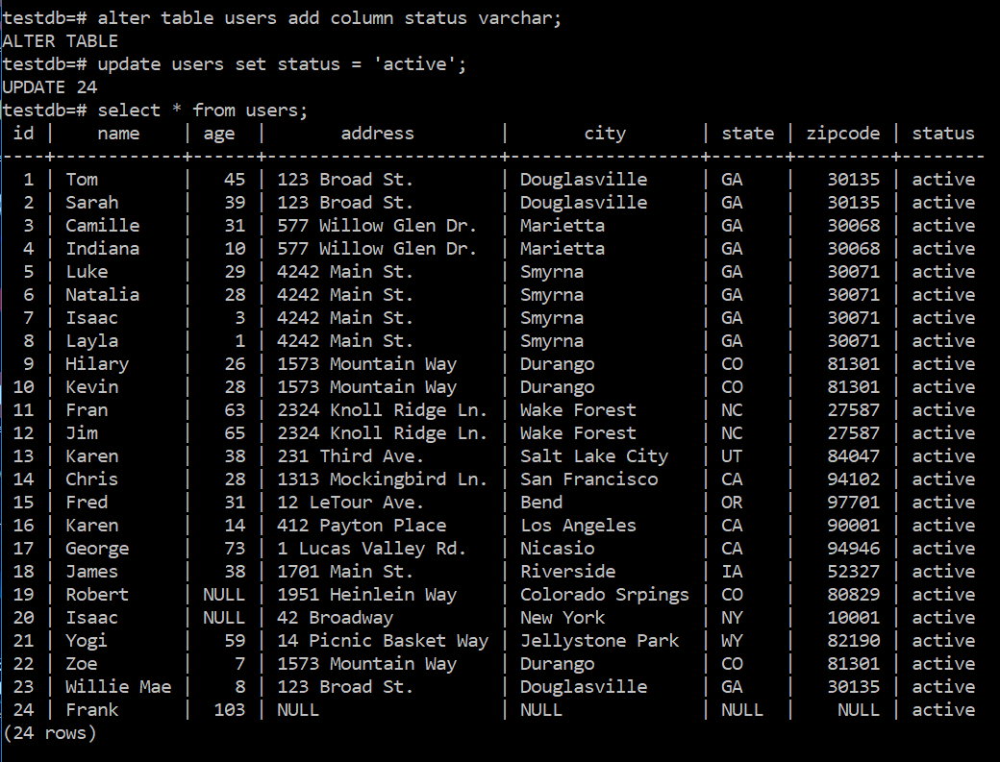

I typically make a habit of testing my ```WHERE``` clause with a ```SELECT``` command prior to running an ```UPDATE```
command. Of course, that assumes that I'm doing this by hand, but that's not uncommon in the development cycle.

And an example of setting multiple fields. Of course we can also do things like correct the spelling of certain cities.

```SQL
UPDATE users
	SET (city, status) = ('Colorado Springs', 'inactive')
	WHERE city = 'Colorado Srpings';
```

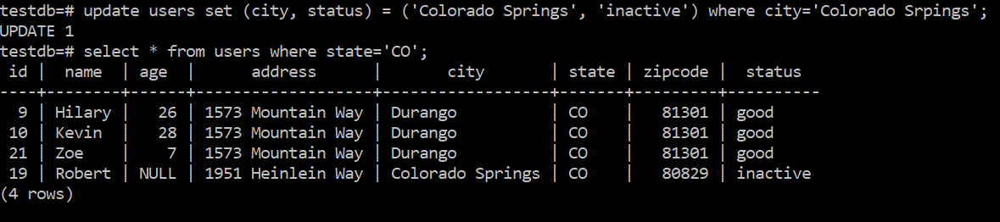

One last example

```SQL
UPDATE users
	SET status = 'inactive'
	WHERE age < 18 or age > 65;
```

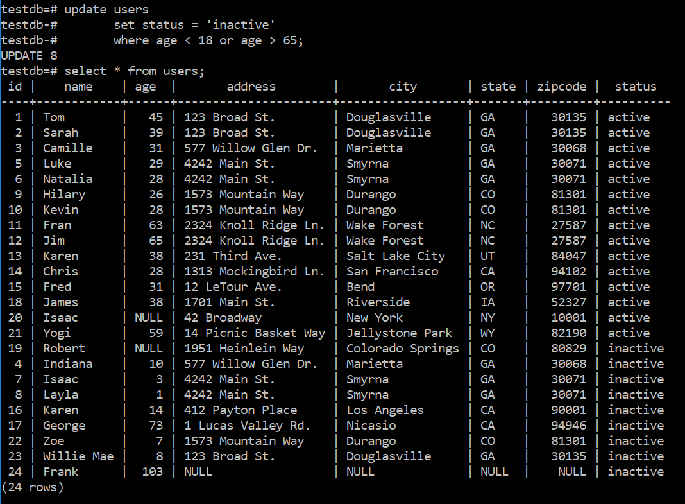

### Exercises

1. Write and execute a command to fill in the rest of Frank's information.

2. Write and execute a command that updates the status of all users under the age of 18 to 'young'. Your table should look
like this after executing the command:

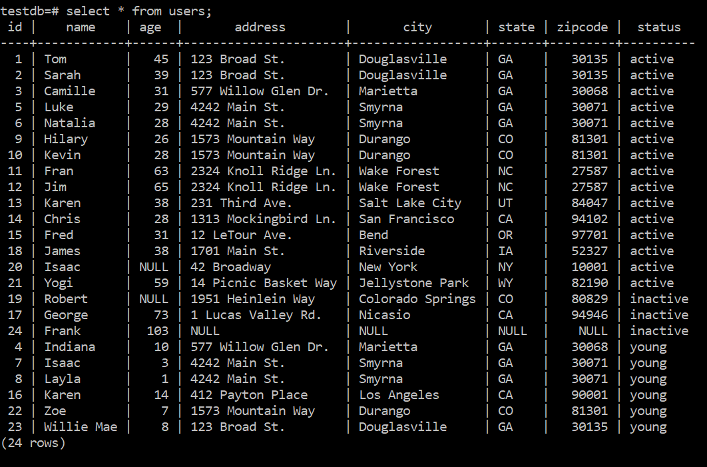

<details><summary>
	Solution
</summary><p>

```SQL
UPDATE users
	SET status='young'
	WHERE age < 18;
```

</p></details>

3. Write and execute a command that sets the status of all users living east of the Mississippi to 'inactive'. Note:
Another option in the ```WHERE``` clause is ```WHERE field IN ( value1, value2, ... )``` which looks for all records that
have one of the listed values in the specified field. Your table should look like this after executing the command:

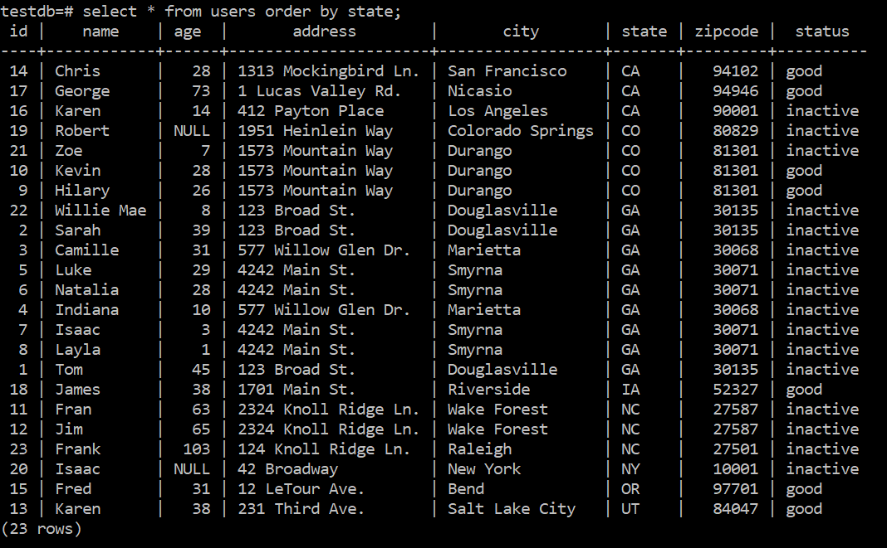

<details><summary>
	Solution
</summary><p>

```SQL
UPDATE users
	SET status='inactive'
	WHERE state IN ('GA', 'NC', 'NY');
```

</p></details>

4. Write and execute a command that changes the name of all 'Karen's to 'Deborah'. Your table should look like this after
executing the command:

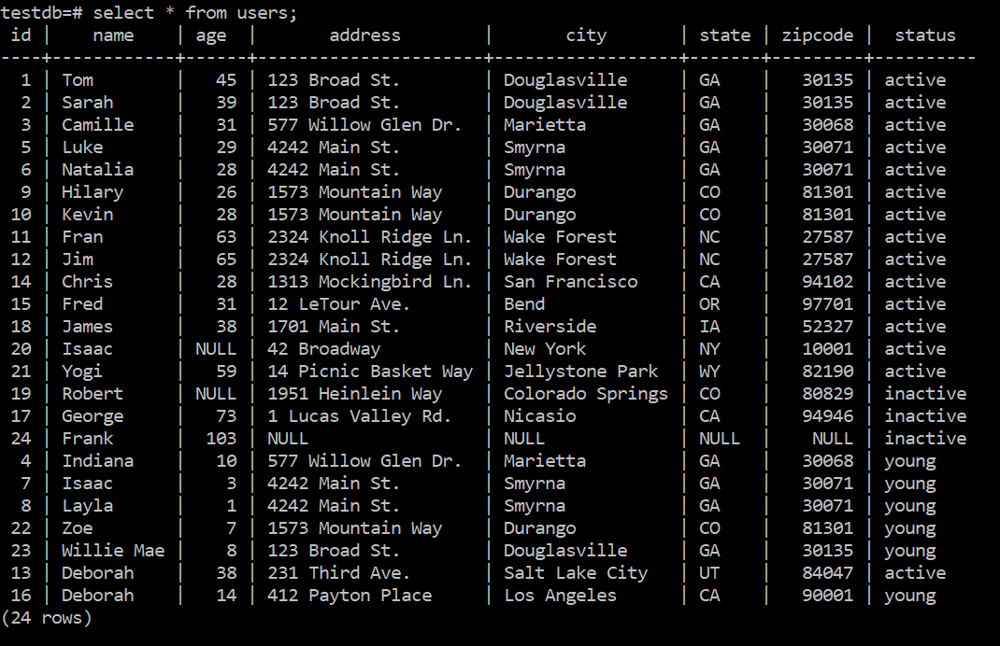

<details><summary>
	Solution
</summary><p>

```SQL
UPDATE users
	SET name = 'Deborah'
	WHERE name = 'Karen';
```

</p></details>

5. Write and execute a command that increases all ages by 1. (```SET age = age + 1```) Your table should look like this
after executing the command:

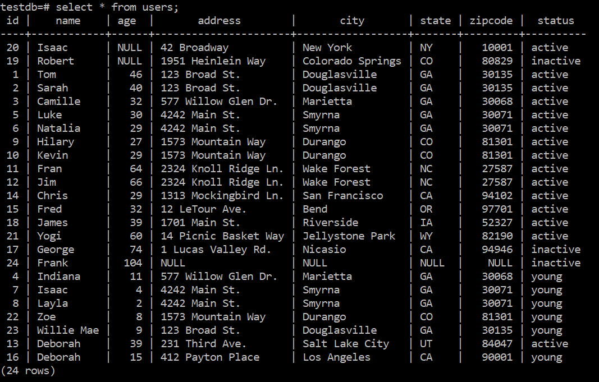

<details><summary>
	Solution
</summary><p>

```SQL
UPDATE users
	SET age = age + 1
	WHERE age IS NOT NULL;
```

The ```WHERE age IS NOT NULL``` may not be necessary but is good practice as addition with a NULL isn't defined.

</p></details>

## The DELETE Statement

And finally the ```DELETE``` command deletes rows from a table. The base syntax is:

```SQL
DELETE FROM table_name
	[ WHERE condition ];
```

Once again you have to be extremely careful. The ```WHERE``` clause is optional and the command will delete
all rows of the table if ```WHERE``` is not specified. (There's another command ```TRUNCATE table_name``` that
will delete all rows of a table if that is what you desire.)

Here's an example:

```SQL
DELETE FROM users
	WHERE age IS NULL;
```

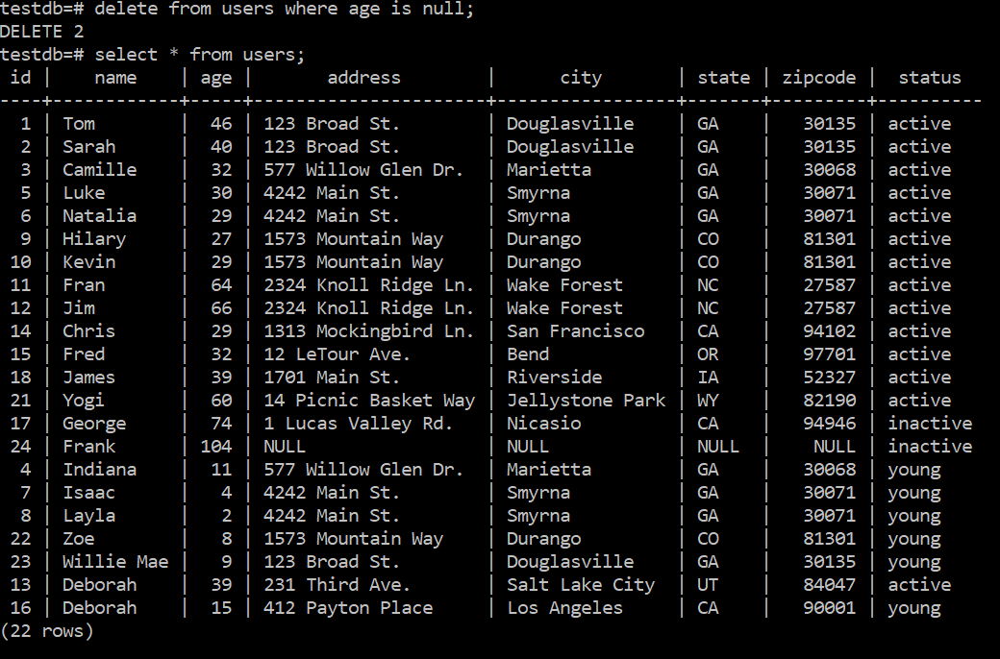

You'll notice that Robert and Isaac are now gone and there aren't any records with NULL ages.

### Exercises

1. Write and execute a command to remove all records where the age is either NULL or under 18. Your resulting
table should look like this:

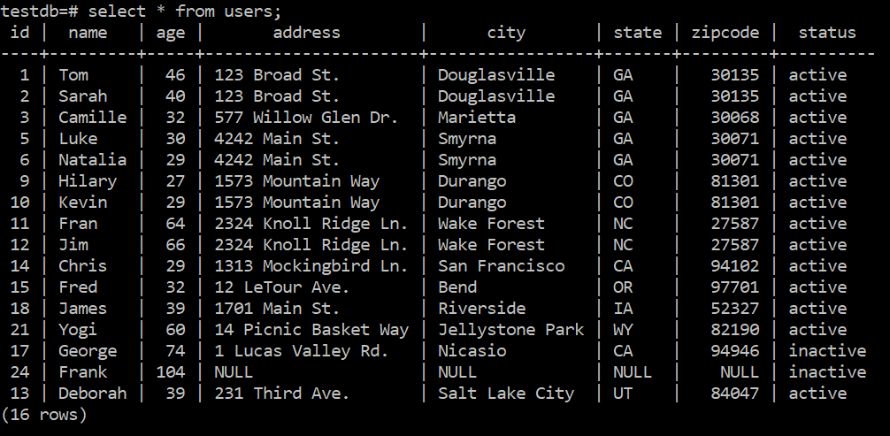

<details><summary>
	Solution
</summary><p>

```SQL
DELETE FROM users
	WHERE age IS NULL
	OR age < 18;
```

</p></details>

