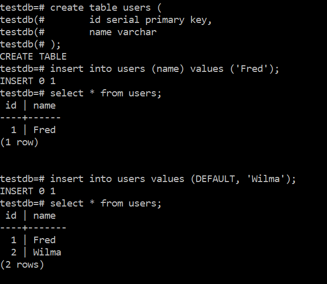
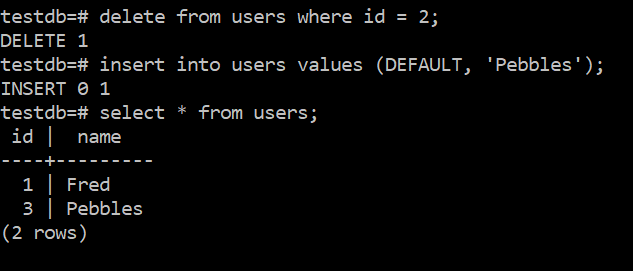
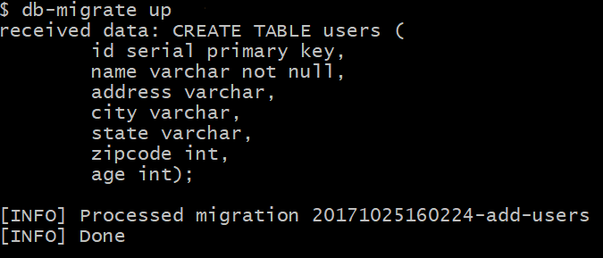
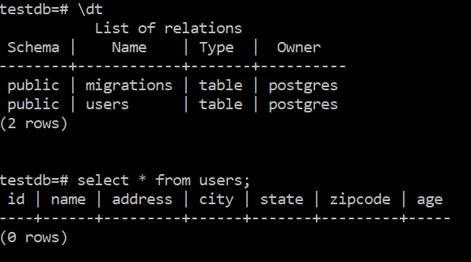
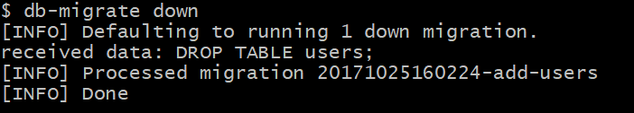
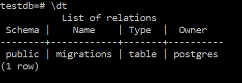
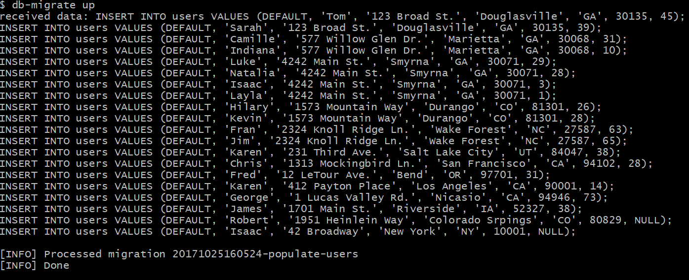
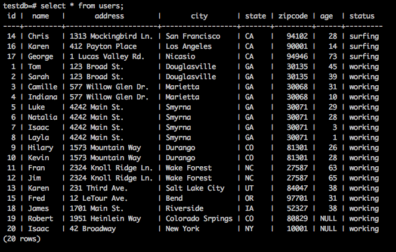

# Database/Schema Migrations

## Overview

Consider the following circumstance. You are working on a project that requires
a database and you decide to collaborate with a partner. Your partner creates a
new column and writes code to use it. After you get your partners code, your
application breaks because your database doesn't contain the new column yet.

**Database or schema migrations** allow you to share table and database
definitions when working on SQL applications on a team. We save our SQL
schema into git and use special migration commands to apply those those
definitions to our own database.

## `SERIAL` data type

We want every table to have an `id` column to uniquely identify records.
So we usually create this column like so:

```SQL
CREATE TABLE users (
	id INT PRIMARY KEY
	...
	);
```

Now every time we insert a new record we need to issue a new id. To do this we
need to remember the last id we've used and increment it by one. But there's
actually a better way. You don't really want to have to keep track of what the
next number is for your key. The answer to this is to declare id a `SERIAL`
type. `SERIAL` is an integer type and automatically uses the next available
integer (starting with 1) for the value.
It isn't automatically a primary key so you still have to declare that.
(So you can use `SERIAL` for fields other than a primary key.)

```SQL
CREATE TABLE users (
	id SERIAL PRIMARY KEY
	...
	);
```

Now you don't have to include the id field in your ```INSERT``` statement.

```SQL
INSERT INTO users (name, ...)
	VALUES ('Fred', ...);
```

Or if you don't want to specify the fields, you can use ```DEFAULT```.

```SQL
INSERT INTO users
	(DEFAULT, 'Fred', ...);
```

Here's a quick example:



One thing to note is that if you delete a record, ```SERIAL``` will not reuse that integer so there's no
problem with duplicate keys.



---

## Part 1: Setup

We'll be using the [`db-migrate` NPM package](https://db-migrate.readthedocs.io/en/latest/) to manage
migrations. This is a command like tool so we need to install it globally
with `-g`:

```sh
npm install -g db-migrate
```

Open the `sql/day1/migrate` in your terminal and run `npm install` to install
other dependencies.

Create an `env.sh` file and put this in it:

```sh
export DATABASE_URL=postgresql://localhost/testdb
```

Where \<username\> is the user name that you created when you installed PostgreSQL. (The default was postgres and that's
probably what you used.) And \<password\> is the password that you created for that user name if you created a password.
Choose the appropriate version and put that into env.sh. Then ```source env.sh``` to get your environment set
up correctly.

TODO username

---

## Part 2: Creating a migration

The first thing to understand is that there are **Up** migrations and **Down** migrations. An up migration
is what we'd typically think of as creating a new database, or adding tables to a database, or modifying
an existing database, etc. Basically this is the direction where we're creating or adding. A down migration
is just the opposite. Effectively a down migration is a scripted rollback of some set of database (SQL)
commands.


Let's start by creating a migration that will create the users tables that we've been using.
Drop your `users` table from earlier:

```sql
DROP TABLE users;
```

When you're in the `sql/day1/migrate` folder create a migration named `add-users` by running:

```
db-migrate create add-users --sql-file
```

Let's break this command down:

1. `db-migrate`: the package we just installed from npm
1. `create` tells `db-migrate` to create a new migrations
1. `add-users`: The name of the migration we're creating. We try to give
migrations descriptive names like `add-users` because it makes easier to read
them later but you can choose any name.
1. `--sql-file`: tells `db-migrate` to create SQL files for us to put migration
code into.

This will create a migrations directory and will create the following files:

```
migrations/20171025160224-add-users.js
migrations/sqls/20171025160224-add-users-down.sql
migrations/sqls/20171025160224-add-users-up.sql
```

**The first part of those file names are a date/time stamp from when the command was run so yours will be
different.**

We don't care about the `.js` file, you can ignore it. It's the `.sql` files
we care about. Edit `migrations/sqls/...-add-users-up.sql` and put this SQL
script in it:

```SQL
CREATE TABLE users (
    id serial primary key,
    name varchar not null,
    address varchar,
    city varchar,
    state varchar,
    zipcode int,
    age int);
```

Now run:

```sh
db-migrate up
```

You should see:



Now the table has been created:



You can also see that a `migrations` table has been created. That's a table that
is created automatically by the `db-migrate` tool and keeps track of the
migrations that have been performed. This way if you run `db-migrate up` again,
it does nothing, because all migrations have already been applied.

And we should go ahead and add the appropriate command to the down migration script. Since we just created
the users table, all we need to do is drop the table.
Edit `migrations/sqls/...-add-users-down.sql` and add:

```SQL
DROP TABLE users;
```

Now run:

```sh
db-migrate down
```

You should see:



And you can see that the users table has been dropped.



OK. Now that we know that works, run `db-migrate up` to bring back the users
table.

---

## Part 3: Your second migration

Let's a create a second migration, we're going to call this migration
`populate-users`:

```
db-migrate create populate-users --sql-file
```

This creates the files:

```
migrations/20171025160524-populate-users.js
migrations/sqls/20171025160524-populate-users-down.sql
migrations/sqls/20171025160524-populate-users-up.sql
```

And I'll add these commands to the up migration SQL file. I could have done all of this in one command but want to demonstrate
multiple commands in the migration file. The file for the up migration is migrations/sqls/20171025160524-populate-users-up.sql.

```SQL
INSERT INTO users VALUES (DEFAULT, 'Tom', '123 Broad St.', 'Douglasville', 'GA', 30135, 45);
INSERT INTO users VALUES (DEFAULT, 'Sarah', '123 Broad St.', 'Douglasville', 'GA', 30135, 39);
INSERT INTO users VALUES (DEFAULT, 'Camille', '577 Willow Glen Dr.', 'Marietta', 'GA', 30068, 31);
INSERT INTO users VALUES (DEFAULT, 'Indiana', '577 Willow Glen Dr.', 'Marietta', 'GA', 30068, 10);
INSERT INTO users VALUES (DEFAULT, 'Luke', '4242 Main St.', 'Smyrna', 'GA', 30071, 29);
INSERT INTO users VALUES (DEFAULT, 'Natalia', '4242 Main St.', 'Smyrna', 'GA', 30071, 28);
INSERT INTO users VALUES (DEFAULT, 'Isaac', '4242 Main St.', 'Smyrna', 'GA', 30071, 3);
INSERT INTO users VALUES (DEFAULT, 'Layla', '4242 Main St.', 'Smyrna', 'GA', 30071, 1);
INSERT INTO users VALUES (DEFAULT, 'Hilary', '1573 Mountain Way', 'Durango', 'CO', 81301, 26);
INSERT INTO users VALUES (DEFAULT, 'Kevin', '1573 Mountain Way', 'Durango', 'CO', 81301, 28);
INSERT INTO users VALUES (DEFAULT, 'Fran', '2324 Knoll Ridge Ln.', 'Wake Forest', 'NC', 27587, 63);
INSERT INTO users VALUES (DEFAULT, 'Jim', '2324 Knoll Ridge Ln.', 'Wake Forest', 'NC', 27587, 65);
INSERT INTO users VALUES (DEFAULT, 'Karen', '231 Third Ave.', 'Salt Lake City', 'UT', 84047, 38);
INSERT INTO users VALUES (DEFAULT, 'Chris', '1313 Mockingbird Ln.', 'San Francisco', 'CA', 94102, 28);
INSERT INTO users VALUES (DEFAULT, 'Fred', '12 LeTour Ave.', 'Bend', 'OR', 97701, 31);
INSERT INTO users VALUES (DEFAULT, 'Karen', '412 Payton Place', 'Los Angeles', 'CA', 90001, 14);
INSERT INTO users VALUES (DEFAULT, 'George', '1 Lucas Valley Rd.', 'Nicasio', 'CA', 94946, 73);
INSERT INTO users VALUES (DEFAULT, 'James', '1701 Main St.', 'Riverside', 'IA', 52327, 38);
INSERT INTO users VALUES (DEFAULT, 'Robert', '1951 Heinlein Way', 'Colorado Srpings', 'CO', 80829, NULL);
INSERT INTO users VALUES (DEFAULT, 'Isaac', '42 Broadway', 'New York', 'NY', 10001, NULL);
```

Run `db-migrate up` again and your new records are added. Note how it skips the `add-users` migration
since we've already run that before.



The down migration is in `migrations/sqls/...-populate-users-down.sql`,
and it should just delete all rows:

```SQL
DELETE FROM users;
```

<details><summary>
Aside: Running only some of the migrations
</summary><p>

The `db-migrate` command has a `-c` option that specifies the number of migrations
to run. So

```
db-migrate down -c 3
```

would run the first 3 down migrations. This is mostly important because the down migration default is to just run
1 migration. So

```
db-migrate down
```

would only truncate the table and would not delete it. (The second down migration.) If you wanted to run both down
migrations you would need to run

```
db-migrate down -c 2
```

</p></details>

### Exercises

1. Create and run all of the migration scripts listed above.

1. Create a new migration to add a new `status` column of type `varchar`
to the `users` table. Then updating the status of all users in
California to be `'surfing'` and the `status` of everyone else to be
`'working'`.

    <details><summary>
    Contents of database after db-migrate up
    </summary><p>

    

    </p></details>

    Running `db-migrate down -c 1` should remove the status column.

1. Create a new migration to create a new `planets` table with the following
columns:

    | Column name | Type | Not Null |
    | :-- | :-- | :-- |
    | id | serial | Y |
    | name | varchar | Y |
    | moons | int | N |

    Populate the table with Mercury, Venus, Earth, Mars and Jupiter
    to the table.
