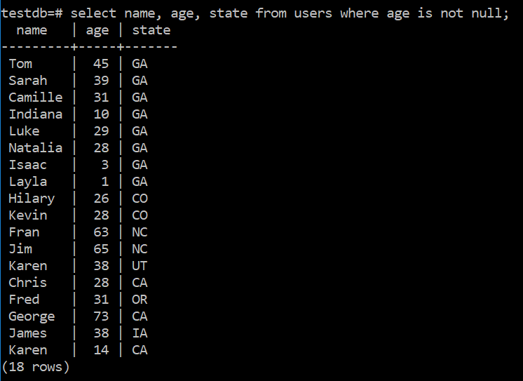
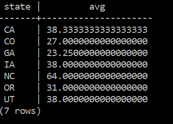

# Read data with SELECT

## Overview

SELECT is the basic tool to read data from a SQL database. The full syntax of SELECT is:


Fortunately, we'll be starting with a subset of this. In particular, we're going to look at the
following clauses of the SELECT statement:

* LIMIT
* ORDER BY
* WHERE
* GROUP BY

## Setup

The first thing is to create a database and some data that we can play with.
Open `psql` and create database named `testdb`. Connect to `testdb` with
`pgweb` and run the following SQL query to create a `users` table:

```sql
create table users (
    id int primary key not null,
    name varchar not null,
    age int,
    address varchar,
    city varchar,
    state varchar,
    zipcode int
);
```

The table `users` should now show up on the left side. Click on the
`users` table then click `Structure` up top to see the columns.
You should see:

<details><summary>
Screenshot: Users table in pgweb
</summary><p>


</p></details>

Now let's populate the `users` table with data. Click `SQL Query` up top
and run the following query:

```sql
insert into users values
    (1, 'Tom', 45, '123 Broad St.', 'Douglasville', 'GA', 30135),
    (2, 'Sarah', 39, '123 Broad St.', 'Douglasville', 'GA', 30135),
    (3, 'Camille', 31, '577 Willow Glen Dr.', 'Marietta', 'GA', 30068),
    (4, 'Indiana', 10, '577 Willow Glen Dr.', 'Marietta', 'GA', 30068),
    (5, 'Luke', 29, '4242 Main St.', 'Smyrna', 'GA', 30071),
    (6, 'Natalia', 28, '4242 Main St.', 'Smyrna', 'GA', 30071),
    (7, 'Isaac', 3, '4242 Main St.', 'Smyrna', 'GA', 30071),
    (8, 'Layla', 1, '4242 Main St.', 'Smyrna', 'GA', 30071),
    (9, 'Hilary', 26, '1573 Mountain Way', 'Durango', 'CO', 81301),
    (10, 'Kevin', 28, '1573 Mountain Way', 'Durango', 'CO', 81301),
    (11, 'Fran', 63, '2324 Knoll Ridge Ln.', 'Wake Forest', 'NC', 27587),
    (12, 'Jim', 65, '2324 Knoll Ridge Ln.', 'Wake Forest', 'NC', 27587),
    (13, 'Karen', 38, '231 Third Ave.', 'Salt Lake City', 'UT', 84047),
    (14, 'Chris', 28, '1313 Mockingbird Ln.', 'San Francisco', 'CA', 94102),
    (15, 'Fred', 31, '12 LeTour Ave.', 'Bend', 'OR', 97701),
    (16, 'Karen', 14, '412 Payton Place', 'Los Angeles', 'CA', 90001),
    (17, 'George', 73, '1 Lucas Valley Rd.', 'Nicasio', 'CA', 94946),
    (18, 'James', 38, '1701 Main St.', 'Riverside', 'IA', 52327),
    (19, 'Robert', NULL, '1951 Heinlein Way', 'Colorado Srpings', 'CO', 80829),
    (20, 'Isaac', NULL, '42 Broadway', 'New York', 'NY', 10001);
```

Click on the `users` table on the left again, you should now see:

<details><summary>
Screenshot: Users table contents in pgweb
</summary><p>


</p></details>

Alright, let's see if we can read this data back using `SELECT` statements.

## Part 1: The SELECT Statement

The SELECT statement is probably the most used tool in the SQL toolbox. As you saw above, it has a rich set of
options and mastering these can make you a very valuable member of a development team. You can also write queries
that take forever to run, so writing efficient queries is also very important. We're not going to worry about
efficiency just yet however.

A SELECT query always returns a table. Even if there is only one field and one record, the structure that is returned
is a table. Let's start with a basic query to get the information from the table.

```SQL
SELECT * FROM users;
```


<details><summary>
Aside: Displaying NULL as NULL in psql
</summary><p>

Normally psql displays NULL as blank which can be confusing. To make null
values visible run:

```
\pset null NULL
```

</p></details>

One important point is that the order in which you receive the rows is random-ish. There's no guarantee of a particular
order unless you specify it. (It's not truly random. The server has an algorithm that it uses to retrieve and format the
data. But it might not be the order that we expected and it might be a different order tomorrow depending on what happened
overnight or what's happening now. For instance, the row with id 16 was originally between ids 15 and 17. But I modified
that row and it went to the bottom of the list in the next query.)

So let's dissect the SELECT statement that I used.

```SQL
SELECT * FROM users;
```

* SELECT - the keyword that tells the server that we're doing a SELECT statement. (But I bet you'd already figured that out.)
* \* - Get all of the fields for the relevant table.
* FROM - Another keyword that tells the command parser that the table name is next.
* users - The name of the table that we're pulling the information from.
* ; - Because we never forget the semicolon.

Instead of '\*', we could have listed the fields that we are interested in. And they don't have to be in the original order.

```SQL
SELECT age, name FROM users;
```


You'll notice that you can list multiple fields with a comma separator.

### Exercises

1. Write and execute a query that displays the name and city of each person in the table.
2. Write and execute a query that displays the states followed by the zip code of each person in the table.

---

## Part 2: The LIMIT Clause

While showing the 20 records of the table in our database isn't too bad, most production databases have tables
that have hundreds/thousands/millions of entries. So we need a way to limit the number of records in the output.
PostgreSQL has a LIMIT clause that allows us to do this. So if we wanted to just show the top 5 records of the table,
we'd do this:

```SQL
SELECT name, age FROM users LIMIT 5;
```


One problem with this is that there's no discrimination on which records we get. This query just returned the \"first\"
5 records, but it was up to the server to determine which records those were. We'll see ways to help that in a minute.

<details><summary>
Aside: LIMIT in other SQL databases
</summary><p>

While most other SQL databases have the functionality to limit output rows,
the syntax is slightly different in each:

* Microsoft SQL Server uses TOP

    ```
    SELECT TOP 5 age FROM users;
    ```

* Oracle SQL uses ROWNUM

    ```
    SELECT age FROM users WHERE ROWNUM <= 5;
    ```

    (We'll see WHERE in just a minute.)

</p></details>


### Exercises

1. Write and execute a query that displays 10 records of the user table.
2. Write and execute a query that displays 30 records of the user table.
(Notice that this still works, but it only shows the 20
records that are actually in the table.)

---

## Part 3: The ORDER BY Clause

As we said before, the records will come out in a random order from the SELECT
statement, but we can control the order with the
`ORDER BY` clause. For example

```SQL
SELECT age FROM users ORDER BY age;
```


This will sort the output by the specified field. It will sort things in ascending
order by default but you can also sort in descending order:

```SQL
SELECT age FROM users ORDER BY age DESC;
```

You'll notice that the NULLs came out at the bottom. NULLs are a special case in
SQL. Unlike in other programming languages, in SQL NULLs are not equal to
anything. In fact, in SQL NULL isn't even equal to itself. You can't compare a
NULL to a number or a string. We use this syntax to specify where NULL appears
in sorted order:

```SQL
SELECT age FROM users ORDER BY age NULLS FIRST LIMIT 5;
```


We can also have more than one field in the order by clause. For instance:

```SQL
SELECT city, state FROM users ORDER BY state desc, city;
```


Note that he various clauses must be in the proper order. See the big syntax diagram at the beginning for that order.
We can also put the NULLs last using ```NULLS LAST``` but that is also the default for an ascending list.

### Exercises

1. Write and execute a query that displays the name and age of each person
sorted by age, then name. Your output should look like this:

    

2. Write and execute a query that displays the name and age of the 5 youngest
people in the table. Your output should look like this:

    

3. Write and execute a query that displays the name and age of the 6 youngest
people in the table. Your output should look like this:

    

    Did your last query correctly reflect all of the people in the list that
    should have been displayed? There are 3 people that are 28.

---

## Part 4: The WHERE Clause

The WHERE clause allows us to filter the records on certain criteria. Let's look at that last exercise.

> Write and execute a query that displays the name and age of the 6 youngest people in the table.

There were 3 entries with an age of 28. It's basically random which of the entries made it onto our list of 5.
But there's another way to constrain the data. Let's look at an example.

```SQL
SELECT name, age FROM users WHERE age < 30 order by age;
```


The new part, of course, is the WHERE clause. This allows us to filter the records on particular constraints. In this case
we read all records for people under the age of 30. You can also filter for strings. In SQL we use single quotes (\'CA\')
to delimit strings. This is different than most programming languages that use double quotes (\"CA\"). Please also notice
that the equals comparison is just a single equals sign (state = 'CA') versus the double equals sign that most programming
languages use.

```SQL
SELECT name, age, state FROM users WHERE state = 'CA';
```


This query reads all records whose state field is equal to 'CA'. And of course we can combine constraints in the usual way.
I'm going to start writing longer queries on multiple lines to make them easier to read.

```SQL
SELECT
	name,
	age,
	state
FROM
	users
WHERE
	age < 30
	AND state = 'CA';
```


You can also use `NOT` to change the constraint.

```SQL
SELECT
	name,
	age,
	state
FROM
	users
WHERE
	age < 30
	AND NOT state = 'CA';
```


There are 3 other types of boolean expressions that you need to know about for the WHERE clause. The first
is `LIKE` which permits us to create wild card expressions. The \'%\' is the wild card character. This query
fetches all records where the first character in the state field is \'C\'.

```SQL
SELECT
	name,
	age,
	state
FROM
	users
WHERE
	state LIKE 'C%';
```


Note that while the SQL language isn't case sensitive, the data in the fields **IS** case sensitive so this query
has a different result.

```SQL
SELECT
	name,
	age,
	state
FROM
	users
WHERE
	state LIKE 'c%';
```


<details><summary>
	ILIKE in PostgreSQL
</summary><p>

PostgreSQL actually **DOES** have ```ILIKE``` which is case-insensitive but I don't know of an equivalent in any of the other implementations.

</p></details>

The next is ```BETWEEN```. This allows you to create an expression that tests for values between upper and lower bounds.
Note that BETWEEN is between inclusively.

```SQL
SELECT
	name,
	age,
	state
FROM
	users
WHERE
	age BETWEEN 20 AND 45;
```


And last is an expression that checks for NULLs.

```SQL
SELECT
	name,
	age,
	state
FROM
	users
WHERE
	age IS NULL;
```


Or check for the absence of NULLs.

```SQL
SELECT
	name,
	age,
	state
FROM
	users
WHERE
	age IS NOT NULL;
```



Once again notice that NULL is really a different beast than it is in most programming languages. See the output of this query:

```SQL
SELECT
	name,
	age,
	state
FROM
	users
WHERE
	age = NULL;
```


You just can't compare NULL to data fields in the normal programming language way.

### Exercises

1. Write and execute a query that will find all records where the age of the person is between 20 and 30 and the person
lives in a city that starts with 'S'. Your output should look like this:

    

    <details><summary>
    Solution
    </summary><p>

    ```SQL
    SELECT
    	*
    FROM
    	users
    WHERE
    	age BETWEEN 20 AND 30
    	AND city LIKE 'S%';
    ```

    </p></details>

2. Write and execute a query that will find the name and state of all records that have a NULL age. Order
your output by state. Your output should look like this:

    

    <details><summary>
    Solution
    </summary><p>

    ```SQL
    SELECT
    	name,
    	state
    FROM
    	users
    WHERE
    	age IS NULL
    ORDER BY
    	state;
    ```

    </p></details>

3. Write and execute a query that will find all records where the person lives in Colorado (CO) and whose name isn't Kevin.
Your output should look like this:

    

    <details><summary>
    Solution
    </summary><p>

    ```SQL
    SELECT
    	*
    FROM
    	users
    WHERE
    	state = 'CO'
    	AND NOT name = 'Kevin;
    ```

    **OR**

    ```SQL
    SELECT
    	*
    FROM
    	users
    WHERE
    	state = 'CO'
    	AND name <> 'Kevin;
    ```

    </p></details>

---

## Part 5: The GROUP BY Clause

The last part of SELECT that we're going to look at now is the ```GROUP BY``` clause. This will just be an
introduction to aggregates as this is a much more complicated topic that we'll explore more thoroughly later.
The ```GROUP BY``` clause allows you to group records by one or more fields. For instance if you wanted to
look at all of the people that live in each state. But this is **ONLY** when you are aggregating data. So you can't
use ```GROUP BY``` to just grab the records where state = 'CO'. We still use the WHERE clause for that. Let's look
at an example.

```SQL
SELECT
	state,
	COUNT(1)
FROM
	users
GROUP BY
	state
ORDER BY
	state;
```


This query took all of the records and grouped them by state. For each of the records in each state, it increased
the count by one (the `COUNT(1)` part), thus giving a count of the number of records in each state. (Note: `COUNT(*)`
is used interchangeably with `COUNT(1)`.) I could use state in this query because we were grouping by state so there
was only one state associated with each count. Let's take a look at what's going on behind the scenes. Consider this
picture of the data.


Each of the records enclosed in a block is effectively now a single record.
Anything that has multiple values (id, name, age, address, city, and zipcode)
basically gets tossed in terms of what can be fetched in a SELECT statement. But
we can do things that "aggregate" the data. For instance, we can count the
number of records (`COUNT(1)`) in each group. Or we could find the minimum
value in a particular field (`MIN(zipcode)`). Or we could find the sum of
all of the values in a particular field (`SUM(age)`).

Let's look at another example.

```SQL
SELECT
	city,
	state,
	COUNT(1)
FROM
	users
GROUP BY
	city,
	state
ORDER BY
	state,
	city;
```


And once again, let's look at the data.


This time we grouped by both city and state. So the data is partitioned accordingly.
And again we can get only that information that is associated with **ALL** of each group. You just can't pull a single record
from a group. This is why this query to find the oldest person in a state doesn't work. There is a way to do this and we'll
look at it later.

```SQL
SELECT
	name,
	state,
	MAX(age)
FROM
	users
GROUP BY
	state;
```

Here's another example.

```SQL
SELECT
	state,
	MAX(age)
FROM
	users
GROUP BY
	state
ORDER BY
	state;
```


This query lists the max age of the people in each state. Notice that the max age for the person in NY is 'NULL'. Why
is that?

<details><summary>
Answer
</summary><p>

That's the **ONLY** record in NY.

</p></details>

One last example.

```SQL
SELECT
	name,
	state
FROM
	users
GROUP BY
	name,
	state
ORDER BY
	name,
	state;
```


When the ```GROUP BY``` has multiple items, name and state in this case, the groups are created based on all possible
divisions of those items. There are two Karen's but they are not grouped together since they are in different states.

Other functions (like COUNT() and MAX()) that you can use are MIN(), SUM(), and AVG().

### Exercises

1. Write and execute a query that displays the average age of the people in each state. (What are you going to
do about those NULLs?) Your output should look like this:

    

    <details><summary>
    	Solution
    </summary><p>

    ```SQL
    SELECT
    	state,
    	AVG(age)
    FROM
    	users
    WHERE
    	age IS NOT NULL
    GROUP BY
    	state
    ORDER BY
    	state;
    ```

    </p></details>

2. Write and execute a query that displays the average age of the people in each city. Make sure to ignore any records that have null in the age. (Hint: GROUP BY both city and state.) Your output should look like this:

    

    <details><summary>
    	Solution
    </summary><p>

    ```SQL
    SELECT
    	city,
    	state,
    	AVG(age)
    FROM
    	users
    WHERE
    	age IS NOT NULL
    GROUP BY
    	city,
    	state
    ORDER BY
    	state,
    	city;
    ```

    </p></details>

---

## Aside: Column Aliasing

There's one last item that needs to be mentioned. You can rename columns
in your output using `AS`:

```SQL
SELECT
	name as customer,
	state place
FROM
	users;
```

Note that the first output column is now labeled `customer`:


The `AS` is optional. You can leave it out:

```SQL
SELECT
	state "State",
	SUM(age)/COUNT(1) "Average Age"
FROM
	users
WHERE
	age IS NOT NULL
GROUP BY
	state
ORDER BY
	state;
```


You can use double quotes when you wish to capitalize something in the alias or
have a space in the column name. Also you see that you can also do calculations
in the SELECT statement.
