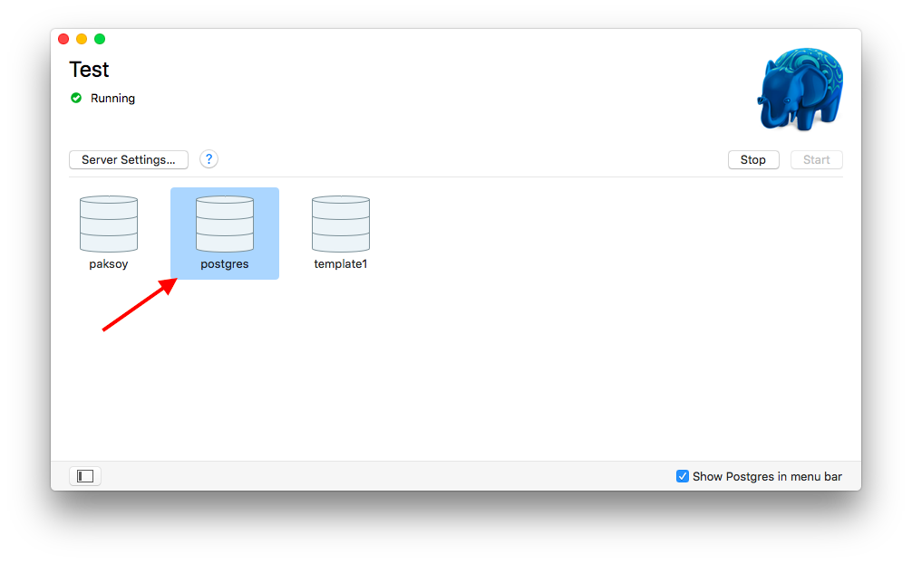

# Mac Installation Instructions

## Part 1: Install Postgres

1. Install [Postgres.app](https://postgresapp.com/)
1. Move the app to your Applications folder
1. Double click `Postgres` inside your Applications folder, click `Initialize`
then click `Start`
1. Inside the `Postgres` app double click on the database named `postgres`

    

    <details><summary>
    Tourbleshooting: if the Postgres window is empty
    </summary><p>

    If the Postgres window is empty run the following commands from your terminal

    ```sh
    /Applications/Postgres.app/Contents/Versions/latest/bin/createuser -U postgres --superuser `whoami`
    /Applications/Postgres.app/Contents/Versions/latest/bin/createdb -U `whoami` `whoami`
    ```

    </p></details>

1. You should see the `psql` prompt in your terminal

    

1. You now have Postgres running on your laptop! Type `\q` to exit

## Part 2: Install pgweb

`pgweb` is a graphical interface for using Postgres databases. We find it
makes working with the database easier.

1. Download [pgweb](https://github.com/sosedoff/pgweb/releases/download/v0.9.9/pgweb_darwin_amd64.zip) into your `Downloads` folder
1. Open your terminal and run the following commands:

    ```sh
    cd ~/Downloads
    unzip pgweb_darwin_amd64.zip
    unzip pgweb_darwin_amd64 ~/pgweb
    ```

1. To start pgweb, open your terminal and type `./pgweb`. This will bring
up a browser window. If not navigate to [localhost:8081](http://localhost:8081/).

    You will see:

    

1. Leave everything blank, and set **SSL Mode** to **disable** then click `Connect`

    You should now see:

    

## Done!

[Go back and complete the Setup module!](setup.md)
