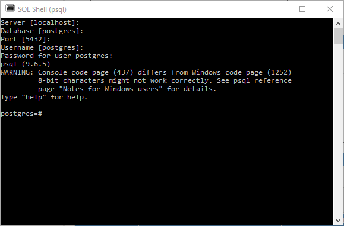
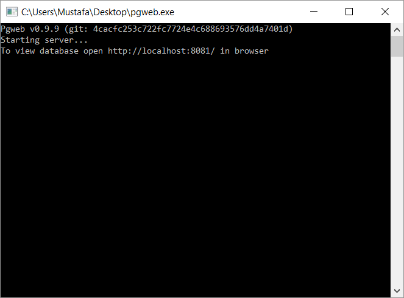
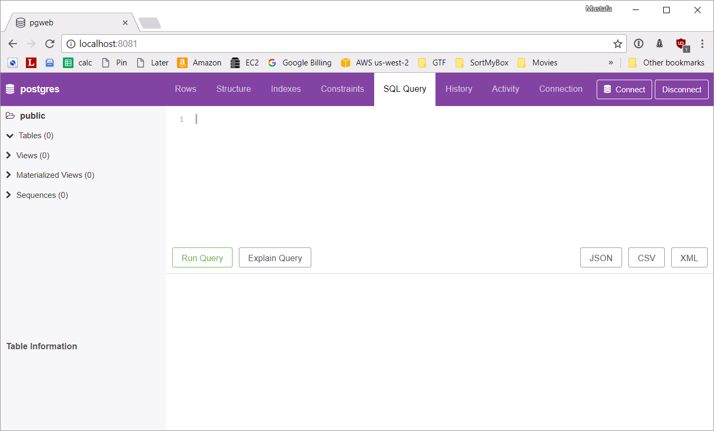

# Postgres Windows Installation Instructions

## Install Postgres

1. Go to https://www.enterprisedb.com/downloads/postgres-postgresql-downloads#windows
1. Select version PostgreSQL 9.6.5
1. Select your version of Windows
1. Download and run the installer
1. When prompted for a password, make sure you note it down
1. Run `SQL Shell (psql)` from the start menu.

    When prompted leave Server, Database, Port, Username blank.
    Enter the password you set during installation.

    If successful, you should see this:

    

## Install pgweb

1. Go to [pgweb's downloads site](https://github.com/sosedoff/pgweb/releases/tag/v0.9.9)
1. If you're running 64-bit Windows download (more common) `pgweb_windows_amd64.exe.zip`,
if you're running 32-bit Windows download (less common) `pgweb_windows_386.exe.zip`
1. Extract the contents of the zip file, move the `.exe` to your desktop
1. Double-click on the `.exe` that you just moved to your desktop

    You should see:

    

1. Visit [localhost:8081](http://localhost:8081) in your browser
1. For **Username** type in `postgres`, for **Password** fill in the password
you used during installation and set **SSL Mode** to `disable`, leave other
fields blank, then click `Connect`

    You should see:

    

## Done!

[Go back and complete the Setup module](setup.md)
