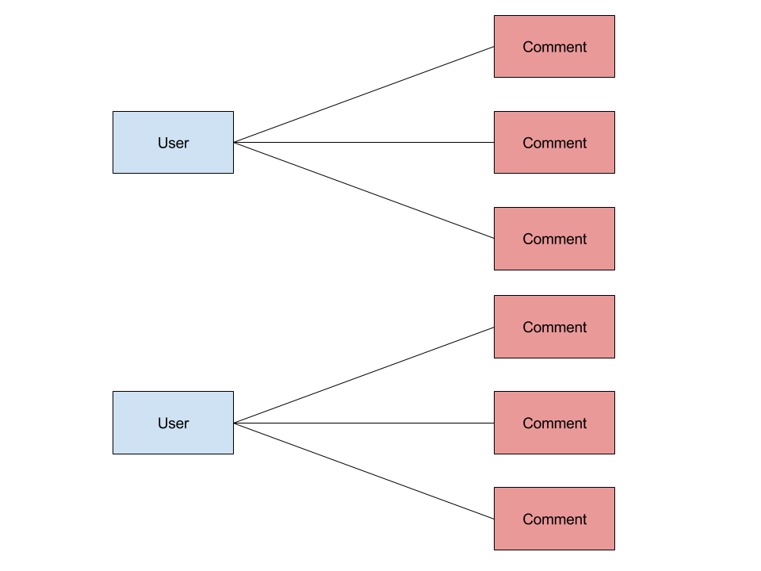
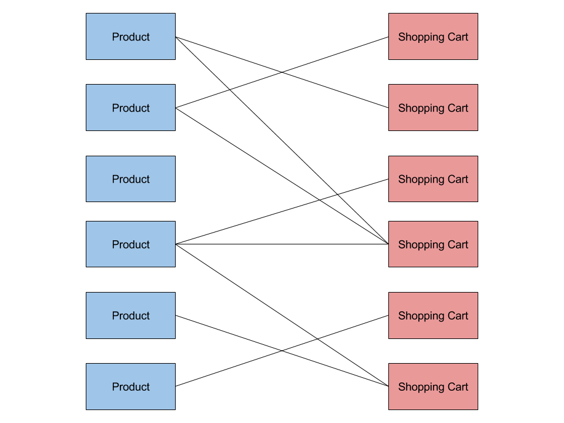

# Normalization

## What's normalization?

Normalization is the practice of structuring data in SQL databases so that there
is one and only one place where each piece of data is stored. In other words,
normalizing your schema means eliminating data duplication.

Let's say we're building a web app for a public comment board. Our application
needs to store registered users and their comments. We also want to be able to
display the first and last name of a commenter along with their comments.
We could build our schema like so:

`users` table contains:

- `id`: auto generated user id
- `email`: email of user
- `first_name`: first name of user
- `last_name`: last name of user
- `password`: password of user

`comments` table contains:

- `id`: post id
- `author_first_name`: first name of the user who posted this comment
- `author_last_name`: last name of the user who posted this comment
- `comment_date`: date when post was written
- `contents`: the contents of the comment

There are a few problems with this. If a user decided to change their first or
last name, we would need to find all comments they have ever posted and update
them. Or say we decide to display email addresses along comments, we would have
to add `author_email` to the `comments` table then populate it.

These problems stem from the fact that our schema is **not normalized**.
The `first_name` and `last_name` for a given author is stored in multiple
places and we have to painstakingly keep all those locations consistent.

In a normalized schema there is one and only one location where a each piece
of data is stored. Here's how we can normalize this schema:

Normalized `comments` table would now contain (`users` table stays the same):

- `id`: post id
- `author_id`: id of the user who posted this comment
- `comment_date`: date when post was written
- `contents`: the contents of the comment

We can then use a `JOIN` query to read the comments and their authors at the
same time:

```sql
SELECT comments.contents, users.first_name, users.last_name
    FROM comments
    JOIN users
        ON comments.author_id = users.id;
```

Now if we want to pick out the email address it's as easy as adding another
column to our `SELECT` statement:

```sql
SELECT comments.contents, users.first_name, users.last_name, users.email
    FROM comments
    JOIN users
        ON comments.author_id = users.id;
```

---

## Designing normalized schemas

To design a normalized schema you have to answer two questions:

1. What are the different entities in my application?
1. What's the relationship between those entities?

### One-to-many relationships

Take our public comment board example. Let's answer the two questions:

1. What are the different entities in my application?

    We have two entities, users and comments.

1. What's the relationship between those entities?

    Each comment belongs to a single user.
    Each single user can have many comments. We can picture this relationship
    like so:

    

This is known as a **one-to-many relationship.** (Where one user maps to
many comments, but one comment only maps to one user.)

In SQL we represent one-to-many relationships by adding the key of
the "one" entity to the table of the "many" entity.
In the case of comments, we added `author_id` to the `comments` table.

When we add a column to a table that contains an id for another table,
we call that a **foreign key**. In our case, the user id we added to the
`comments` table is a foreign key. It lives on the `comments` table but it
belongs to `users` table. Like a foreigner.

### Many-to-many relationships

Let's design a schema to represent products and shopping carts in an e-commerce
application. In this case, each product can be in multiple shopping carts
(i.e. multiple people can have the same book in their shopping cart).
Each shopping cart can contain multiple products.

We can picture this relationship as:



This is known as a **many-to-many relationship.** (Where one shopping cart
cart maps to many products and vice versa.)

In SQL we represent many-to-many relationships by creating a separate table.
This table is called a [junction or join table](https://en.wikipedia.org/wiki/Associative_entity)
and it will contain two foreign keys, one for each side of the many-to-many
relationship:

In the case of our product/shopping cart example, we would have 3 tables:

**products** would have columns `id` and `product_name`.

**shopping_carts** would just have an `id` column.

**products_shopping_carts** (junction table) would have a `product_id` and a
`shopping_cart_id` column.

To add the product with id 42 to the shopping cart with id 87 we would do:

```sql
INSERT INTO products_shopping_carts
    (product_id, shopping_cart_id) VALUES
    (42, 87);
```

To get the names of all products inside the shopping cart with id 123 we can do:

```sql
SELECT products.name
    FROM products
    JOIN products_shopping_carts
    ON products.id = products_shopping_carts.product_id
    WHERE products_shopping_carts.shopping_cart_id = 123;
```

We can also find all the carts that contain the product with id 777:

```sql
SELECT products_shopping_carts.shopping_cart_id
    FROM products_shopping_carts
    WHERE products_shopping_carts.product_id = 777;
```

### One-to-one relationships

The final and simplest relationship in SQL is a **one-to-one** relationship.
An example would be `email` and `user`. Every user has one email address
and each email address belongs to one user. We typically represent
`one-to-one` relationships by storing them on the same table as separate
columns. So you don't need to do any joins to handle them.

---

## Exercises: Normalize these schemas

### Part 1: Professors, students, courses

TODO

---

### Part 2: Instagram following and followers

TODO

---

### Part 3: Amazon Products and Subproducts

TODO

---

### Part 4: PokeBay

Design the schema for an auction site

---

Exercises

1. Amazon where products have subproducts, product categories

    Give a Schema where info is duplicated

    Must be able to rename a product by updating a single row on a single table

    Must be able to get all products for a given type

    Must be able to modify the price of a single subproduct

1. Give a bad schema for instagram

    User: followers, following columns

    Fix this so we can make a user follow another user by inserting a single row into a single table (no updates)

    Bonus: given a user, find all people user is following who don’t follow back

1. Designa schema for kickstarter where there are projects and users, every user can contribute to 0 or more projects, every project can have 0 or more contributors

    Get all project that a user had contributed

    Get all users who have contributed to a project

    Get total contributions to a project

    User can make a contribution to a project by inserting a single row into a single table (no updates to other tables allowed)

1. Design a course catalog schema for a school where there are courses, professors and students.  Each course has a single professor. Each professor can teach multiple courses. Each course can have multiple students in it and each student can take multiple courses

    Student can join a course by inserting a single row into a single table

    You can change the professor of a course by updating a single column of a single table

    You can list all students taking a course

    You can list all courses a student is taking

1. Bonus: design a schma for hierarchical comment threads. In a hierarchical comment thread, each comment can have replies and each reply can have replies of its own. Your schema should be able to

    Double bonus: write a query to get all subreplies for a given comment (replies, replies to replies, replies to replies to replies etc.)
---

TODO remove below

## PokeBay

- Instagram: get followers, get following
- (bonus) Facebook?
- message board
- product listings on amazon where a single product can have many subproducts each with a different color and price
- Kickstarter where user can “fave” projects
- bonus: hierarchical comments, each comment can have a parent
- double bonus: given a parent comment query all descendants
- course has a single professor
- course can have multiple students, student can have multiple courses
