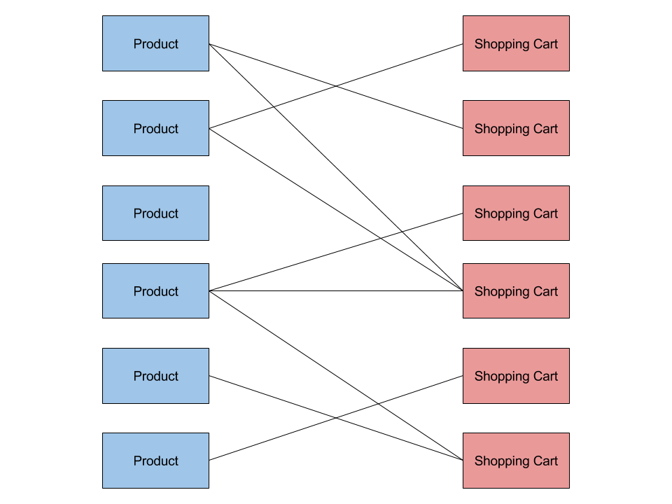

# Normalization

## What's normalization?

Normalization is the practice of structuring data in SQL databases so that there
is one and only one place where each piece of data is stored. In other words,
normalizing your schema means eliminating data duplication.

Let's say we're building a web app for a public comment board. Our application
needs to store registered users and their comments. We also want to be able to
display the first and last name of a commenter along with their comments.
We could build our schema like so:

`users` table contains:

- `id`: auto generated user id
- `email`: email of user
- `first_name`: first name of user
- `last_name`: last name of user
- `password`: password of user

`comments` table contains:

- `id`: post id
- `author_first_name`: first name of the user who posted this comment
- `author_last_name`: last name of the user who posted this comment
- `comment_date`: date when post was written
- `contents`: the contents of the comment

There are a few problems with this. If a user decided to change their first or
last name, we would need to find all comments they have ever posted and update
them. Or say we decide to display email addresses along comments, we would have
to add `author_email` to the `comments` table then populate it.

These problems stem from the fact that our schema is **not normalized**.
The `first_name` and `last_name` for a given author is stored in multiple
places and we have to painstakingly keep all those locations consistent.

In a normalized schema there is one and only one location where a each piece
of data is stored. Here's how we can normalize this schema:

Normalized `comments` table would now contain (`users` table stays the same):

- `id`: post id
- `author_id`: id of the user who posted this comment
- `comment_date`: date when post was written
- `contents`: the contents of the comment

We can then use a `JOIN` query to read the comments and their authors at the
same time:

```sql
SELECT comments.contents, users.first_name, users.last_name
    FROM comments
    JOIN users
        ON comments.author_id = users.id;
```

Now if we want to pick out the email address it's as easy as adding another
column to our `SELECT` statement:

```sql
SELECT comments.contents, users.first_name, users.last_name, users.email
    FROM comments
    JOIN users
        ON comments.author_id = users.id;
```

---

## Designing normalized schemas

To design a normalized schema you have to answer two questions:

1. What are the different entities in my application?
1. What's the relationship between those entities?

### One-to-many relationships

Take our public comment board example. Let's answer the two questions:

1. What are the different entities in my application?

    We have two entities, users and comments.

1. What's the relationship between those entities?

    Each comment belongs to a single user.
    Each single user can have many comments. We can picture this relationship
    like so:

    

This is known as a **one-to-many relationship.** (Where one user maps to
many comments, but one comment only maps to one user.)

In SQL we represent one-to-many relationships by adding the key of
the "one" entity to the table of the "many" entity.
In the case of comments, we added `author_id` to the `comments` table.

When we add a column to a table that contains an id for another table,
we call that a **foreign key**. In our case, the user id we added to the
`comments` table is a foreign key. It lives on the `comments` table but it
belongs to `users` table. Like a foreigner.

### Many-to-many relationships

Let's design a schema to represent products and shopping carts in an e-commerce
application. In this case, each product can be in multiple shopping carts
(i.e. multiple people can have the same book in their shopping cart).
Each shopping cart can contain multiple products.

We can picture this relationship as:



This is known as a **many-to-many relationship.** (Where one shopping cart
cart maps to many products and vice versa.)

In SQL we represent many-to-many relationships by creating a separate table.
This table is called a [junction or join table](https://en.wikipedia.org/wiki/Associative_entity)
and it will contain two foreign keys, one for each side of the many-to-many
relationship:

In the case of our product/shopping cart example, we would have 3 tables:

**products** would have columns `id` and `product_name`.

**shopping_carts** would just have an `id` column.

**products_shopping_carts** (junction table) would have a `product_id` and a
`shopping_cart_id` column.

To add the product with id 42 to the shopping cart with id 87 we would do:

```sql
INSERT INTO products_shopping_carts
    (product_id, shopping_cart_id) VALUES
    (42, 87);
```

To get the names of all products inside the shopping cart with id 123 we can do:

```sql
SELECT products.name
    FROM products
    JOIN products_shopping_carts
    ON products.id = products_shopping_carts.product_id
    WHERE products_shopping_carts.shopping_cart_id = 123;
```

We can also find all the carts that contain the product with id 777:

```sql
SELECT products_shopping_carts.shopping_cart_id
    FROM products_shopping_carts
    WHERE products_shopping_carts.product_id = 777;
```

### One-to-one relationships

The final and simplest relationship in SQL is a **one-to-one** relationship.
An example would be `email` and `user`. Every user has one email address
and each email address belongs to one user. We typically represent
`one-to-one` relationships by storing them on the same table as separate
columns. So you don't need to do any joins to handle them.

---

## Exercises: Normalize these schemas

### Setup

1. Create a new database called `normalize`.
1. Go to folder `sql/day2/normalize`
1. Create and source `env.sh` that contains a `DATABASE_URL`
that connects you to this database.
1. Run `npm install` and `db-migrate up`

### Part 1: Professors, students, courses

In the folder `sql/day2/normalize` you will find migrations
that create a schema for a school. This schema is not normalized,
create a new migration to normalize it.

✅ Run `db-migrate up` to test your migration.

#### Entities

1. Professors have the properties

    - name: `text`, legal name of the professor
    - email: `text`, email address of the professot

1. Students have the property

    - name: `text`, legal name of the student

1. Courses have the property

    - name: `text`, the name the course is listed under

#### Relationships

- Each professor can teach multiple courses.
- Each course is taught by a single professor.
- Students can take multiple courses.
- Each course can be taken by multiple students.

<details><summary>
Solution
</summary><p>

You can find the solution SQL in the `solution/` folder.

</p></details>

---

### Part 2: Instagram following and followers

Design a schema for a social networking app where users have the ability to
follow each other.

#### Entity

1. Users have a username property of type `text`

#### Relationships

- Users can follow 0 or more other users
- Users can be followed by 0 or more other users
- Users don't automatically follow each other back, i.e. if A follows B, B
doesn't necessarily follow A

It should be possible to query your schema to find all followers for a given
user or to find all users that a given user is following.

✅ Go to the folder `sql/day2/normalize` and create migrations to create
a normalized schema. Run `db-migrate up` to test your migration.

<details><summary>
Solution
</summary><p>

You can find the solution SQL in the `solution/` folder.

</p></details>

---

### Part 3: Amazon Products and Subproducts

Design a schema for an e-commerce app where products can have subproducts.
Take this example of a
[water bottle listed on Amazon](https://www.amazon.com/CamelBak-Bottle-0-75-Liter-African-Violet/dp/B015DJASPY/).
This product has a single product page with user rating and detailed description
where the user can find a number of different colors each with a different price.

#### Entities

1. Products have the properties

    - name of the product, `text`
    - detailed description of the product, `text`
    - user rating, average number of stars the product has been given, `int`

1. Subproducts have the properties

    - price in dollars, `decimal`
    - color, `text`

#### Relationships

Exercise left to you!

It should be possible to query your schema to find all subproducts for a
given product.

✅ Go to the folder `sql/day2/normalize` and create migrations to create
a normalized schema. Run `db-migrate up` to test your migration.

<details><summary>
Solution
</summary><p>

You can find the solution SQL in the `solution/` folder.

</p></details>

---

### Part 4: PokeBay

Design the schema for an auction site where Pokemon can be bought and sold.
Your schema should support the following features:

1. **User registration**

    When a user registers to our application they will be prompted for the
    following information:

    - First and last name: must be stored separately
    - Address: broken down into street address, city, state, zipcode
    - Username
    - Password
    - Email address
    - Phone number

1. **User login**

    Users login by providing a username and password.

1. **Pokemon catalog**

    Pokemon are bought and sold on our auction site. Users can view a list
    of all Pokemon with the following information:

    - the name of the Pokemon
    - a picture of the Pokemon (you only need to store the URL for an image)
    - types: each Pokemon can have one or more types. Each type is a string.

1. **Creating auctions**

    Logged in users can create auctions by providing the following information:

    - Pokemon: each auction sells one and only one Pokemon. User can pick a
    Pokemon from a list of available Pokemon.
    - Opening bid: each auction has a starting bid, all subsequent bids
    must be higher than this amount
    - Reserve price: if the auction closes for less than this amount of
    money, the auction is cancelled and the item is not sold. This
    amount is hidden from users other than the auction creator and acts
    as a hidden minimum price.
    - Auction length: duration of the auction in number of days
    - Shipping location: where the Pokemon will be shipped from
    - Description: customizable detailed description about Pokemon being sold

1. **Viewing auctions**

    Any user (logged in or logged out) can view all auctions.
    Users can see the following info about auctions:

    - Username and city of the user who created the auction
    - When the auction was created
    - Status of the auction: either running or finished
    - Start date of auction
    - How much time is left in the auction (based on start date and duration)
    - The amount of highest bid for the auction (if any bids were made), who
    made the highest bid and when

1. **Bidding on auctions**

    Logged in users can bid on auctions based on the following rules:

    - Users can only bid on auctions that are still running
    - The current highest bidder cannot bid on an auction
    - The new bid has to be at least $0.50 more than the last bid
    - The owner of the auction cannot bid on their own auction

---

## Done

TODO
