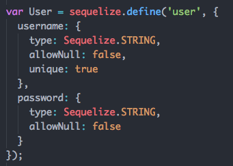
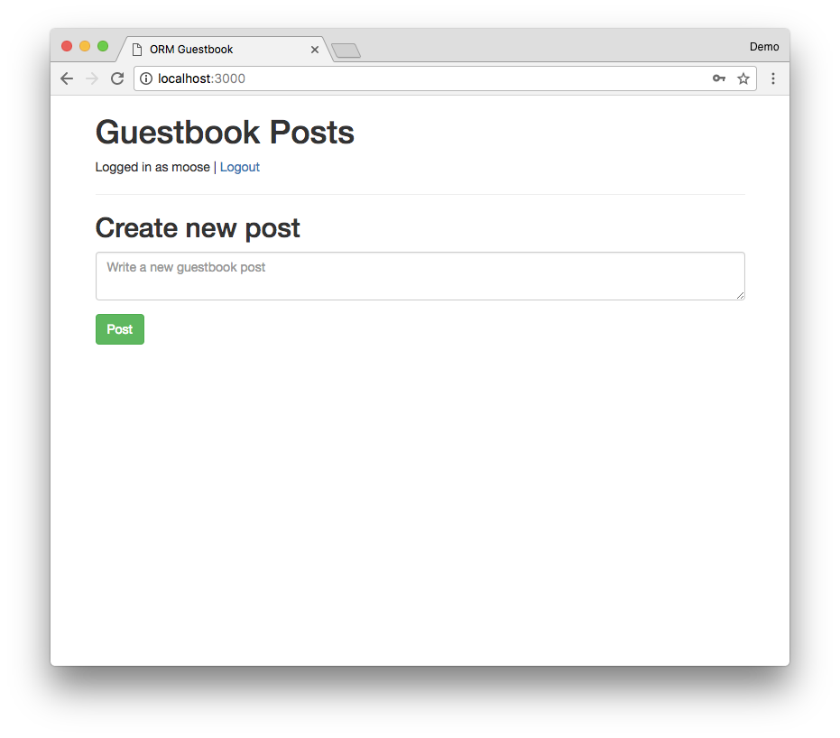
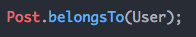
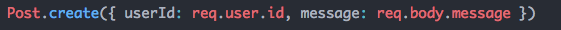
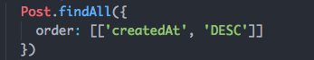
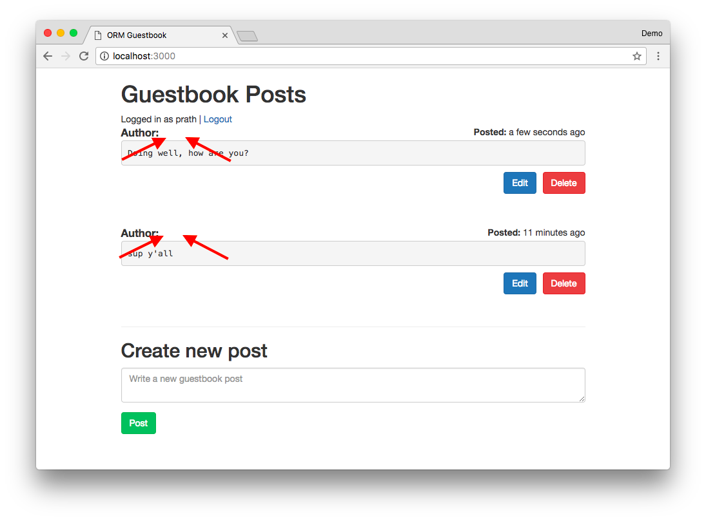
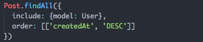
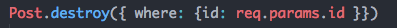
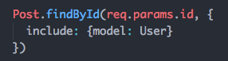
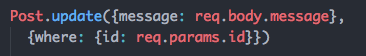

# Self-directed Tutorial and Exercises: Object Relational Mapping

## Intro to Object Relational Mapping

In previous exercises, you've been writing your own SQL queries to communicate
to Postgres. This is a manual and tedious process. Sequelize is a tool
that makes interacting with relational databases like Postgres easier by
generating SQL for you.

Sequelize generates SQL queries from JavaScript function calls and turns the
results into JavaScript objects. To use Sequelize we first declare a Model
object (this is similar to Mongoose). We can then call functions on these
models to read and update data. For example, `Model.findAll()` would
run a `SELECT * FROM model` query behind the scenes.
This is called Object Relational Mapping, ORM.

In this exercise, you will read and write data to Postgres using Sequelize.
And you will be reading Sequelize documentation to learn how to use it.

Navigating and reading documentation is a learned skill just like coding.
It will be hard at first but you will get better with practice. Most
importantly, as you become comfortable reading documentation you will gain the
ability to teach yourself new tools and technologies, which is awesome!

---

## Part 0: Setup

You're going to build a Guestbook app with user logins and the ability to
post, edit and delete Guestbook posts. We've written the Handlebars files
for you. You will need to implement the Express endpoints and make the
appropriate database queries using Sequelize.

### [Read: Sequelize getting started](http://docs.sequelizejs.com/manual/installation/getting-started.html)

### Exercises

1. Create a new database in Postgres called `guestbook`
1. If you're on Windows create an `env.sh` file with the Postgres password
you set when you installed Postgres and `source env.sh`.
**Note that this env.sh file is different from yesterday!**

    ```sh
    export DBPASSWORD="YOUR POSTGRES PASSWORD HERE"
    ```

    You don't need an `env.sh` file on Mac.
1. Open `models.js` in your browser. You have everything you
need to connect to your local Postgres!

    Run `node models.js`, you should see:

    ```
    Connection has been established successfully.
    ```

---

## Part 1: Model definitions

We configure Sequelize to use our database tables correctly by creating
Model objects. Similar to how Mongoose works, Sequelize models also
contain a declaration of the columns that are part of our table.

Sequelize adds these 3 columns to every model automatically:

1. `id` auto generated numeric id
1. `createdAt` a timestamp indicating when this record was created
1. `updatedAt` a timestamp indicating when this record was last updated

For example take the `animals` table we created previously. It contains three
columns of type `TEXT`: name, food, and sound. In Sequelize we would declare
the same table as:

```javascript
var Animal = sequelize.define('animal', {
    name: Sequelize.TEXT,
    food: Sequelize.TEXT,
    sound: Sequelize.TEXT
});
```

Declaring a Model in Sequelize does not automatically create the necessary
tables. We can create these tables using the `.sync()` function:

```javascript
sequelize.sync();
```

By default `.sync()` does not modify existing tables. If we change the schema
of an existing table we must use `{force: true}` for the changes to take effect;

```javascript
sequelize.sync({force: true});
```

We've written a script in `orm/sync.js` that calls `.sync({force: true})` to
apply schema changes. You can run it directly from the command line in the
`orm` directory:

```sh
node sync.js
```

Note that this will delete data in your existing tables.

### [Read: Sequelize Model Definitions](http://docs.sequelizejs.com/manual/tutorial/models-definition.html)

### Exercises

1. Edit `models.js` and create a `User` model with the following columns:

    1. `username`, type: `Sequelize.STRING`, not nullable (i.e. required), unique
    1. `password`, type: `Sequelize.STRING`, not nullable (i.e. required)

    <details><summary>
    Solution: user schema definition
    </summary><p>

    

    </p></details>

1. Run `node sync.js` then connect to your database via pgweb or psql and check
that your table exists and it contains the right columns

    <details><summary>
    Checking tables in psql
    </summary><p>

    When using the Postgres command line utility `psql` you can list
    all tables in the current database with the command `\dt`

    ```
    \dt
             List of relations
     Schema | Name  | Type  |  Owner
    --------+-------+-------+----------
     public | animals | table | postgres
    ```

    For a given table, you can check its columns with `\d tablename`

    ```
    \d users
                                   Table "public.users"
      Column   |           Type           |                     Modifiers
    -----------+--------------------------+----------------------------------------------------
     id        | integer                  | not null default nextval('users_id_seq'::regclass)
     username  | character varying(255)   | not null
     password  | character varying(255)   | not null
     createdAt | timestamp with time zone | not null
     updatedAt | timestamp with time zone | not null
    Indexes:
        "users_pkey" PRIMARY KEY, btree (id)
        "users_username_key" UNIQUE CONSTRAINT, btree (username)
    ```

    </p></details>

---

## Part 2: Creating and finding users

Once you've declared a model you can use it to add or retrieve data.

Use `.create()` to add new data to the database. This will get turned into a
`INSERT` statement behind the scenes.

We can add a new row to our `Animal` table like so:

```javascript
Animal.create({name: 'cow', food: 'grass', sound: 'moo'});
```

Use `.findAll()` to read data back. `.findAll()` generates `SELECT` statement
and if you want to filter data with a `WHERE` clause you must specify a
`{where: {sound: 'moo'}}`. For instance you can read the cow from the animals
table with:

```javascript
Animal.findAll({where: {name: 'cow'}});
```

Both `findAll()` and `create()` return Promises so we can combine them
using `.then()`s.

```javascript
// Save an animal then read it back
Animal.create({name: 'donkey', food: 'carrots', sound: 'hee-haw'})
.then(function() {
    return Animal.findAll();
})
.then(function(animals) {
    console.log(animals); // contains 'donkey'
});
```

### [Read: Sequelize Model Usage](http://docs.sequelizejs.com/manual/tutorial/models-usage.html)

### Exercises

1. Edit `auth.js` and implement the `POST /register` endpoint to create a
a new user `req.body.username` and `req.body.password`. If the registration
is successful, redirect to `/login`.

    Export the `User` model from `models.js` and `require()` it into
    `auth.js`.

1. Run `node app.js` and go to `localhost:3000/register` and register a user.
Check the contents of the `users` table with `psql` or `pgweb` to verify that
the user you registered is present.

1. Edit `auth.js` and finish implementing Passport login functionality
    1. Implement `LocalStrategy` and find a user by using `User.findOne()` and
    specifying a where clause.

        See this
        [example of how we implement `LocalStrategy` with `mongoose`](https://github.com/horizons-school-of-technology/express-template/blob/master/app.js#L67),
        you'll need to adapt it to use
        [Sequelize models](http://docs.sequelizejs.com/manual/tutorial/models-usage.html)
    1. Implement `deserializeUser()`, find a user with `User.findById()`
    and call `done()` with `null` as the first argument and the user as
    the second argument.
    1. Restart your server, go to `/login` and login using the user you
    created earlier. You should see:

        <details><summary>
        Successful login screenshot
        </summary><p>

        

        </p></details>

---

## Part 3: Defining Posts

You can use foreign keys and joins with Sequelize using associations.
Read the documentation to learn how to use them.

### [Read: Sequelize Associations](http://docs.sequelizejs.com/manual/tutorial/associations.html)

### Exercises

1. Edit `models.js` and define a new `Post` model that contains the following
column:

    1. `message`, type: `Sequelize.STRING`, not nullable (i.e. required)

1. After you've defined `Post`, create parent-child relationship between
`User` and `Post`, where `Post` is a child of `User`.

    You can use `.belongsTo()` to set up a parent-child relationship between
    User and Post.

    <details><summary>
    Solution: Sequelize and belongsTo
    </summary><p>

    This will create a `userId` column on the `Post` model which
    we can later use to find the `User` who wrote each given post.
    Sort of like `.populate()` in `mongoose`.

    

    </p></details>
1. Run `node sync.js` again. This will delete and re-create all your tables.
Verify that the `posts` table has been created in Postgres and that
it contains `userId` column.

    <details><summary>
    Expected Post schema
    </summary><p>

    ```
        Table "public.posts"
    Column   |           Type           |                     Modifiers
    -----------+--------------------------+----------------------------------------------------
    id        | integer                  | not null default nextval('posts_id_seq'::regclass)
    body      | character varying(255)   | not null
    createdAt | timestamp with time zone | not null
    updatedAt | timestamp with time zone | not null
    userId    | integer                  |
    Indexes:
        "posts_pkey" PRIMARY KEY, btree (id)
    Foreign-key constraints:
        "posts_userId_fkey" FOREIGN KEY ("userId") REFERENCES users(id) ON UPDATE CASCADE ON DELETE SET NULL
    ```

    </p></details>

---

## Part 4: Creating, updating, deleting Posts

Sequelize provides access to the full power of SQL in JavaScript. Read about
complex querying in Sequelize here:

### [Read: Sequelize Querying](http://docs.sequelizejs.com/manual/tutorial/querying.html)

### Exercises

1. Edit `routes.js` and implement the `POST /posts` route. Create a new post
with a `message` and `userId`. You can read `message` from `req.body` and
`userId` from `req.user`.

    You will need to import your `Post` model from `models.js`.

    Verify that your route is going by visiting `localhost:3000/` and
    using the form at the bottom of the page to create a Post.
    Use `pgweb` or `psql` to verify that the new post you created
    exists in the `posts` table with both `message` and `userId` populated.

    <details><summary>
    Solution
    </summary><p>

    

    </p></details>

1. Edit the `GET /` route and change it to read all posts from the database
**in reverse chronological order.** Sequelize models have a builtin
`createdAt` column that contains the time when a row was created, use this
column to order the posts when reading them.

    The `index.hbs` expects the variable `posts` to contain an array post
    objects.

    ```javascript
    res.render('index', {
        posts: ARRAY OF POSTS HERE
    });
    ```

    Create a couple posts, and verify that they are loaded in reverse
    chronological order.

    <details><summary>
    Solution: Ordering in Sequelize
    </summary><p>

    You can pass Sequelize queries an object with the key `order` to
    change the order of results coming back from the database.
    `order` takes a 2-dimensional array, where each sub array contains
    a column name and a sort direction.

    So we can do this:

    

    </p></details>

1. Note when you visit `localhost:3000/` that the `post.user` is not
automatically populated. Update your query from the previous step to populate
`post.user` using the `belongsTo` relationship we set up for `post`.

    

    Verify that your query works by visiting `localhost:3000/` and
    checking that usernames are displayed with posts.

    <details><summary>
    Solution: JOINing in Sequelize
    </summary><p>

    We can instruct Sequelize to join against another table when querying by
    setting the `include` key in the query object. Afterwards `post.user` will
    contain all the information about the user who wrote the post. This behaves
    like `.populate()` in Mongoose.

    `include` takes an object in the form of `{model: MODEL TO JOIN AGAINST HERE}`,
    so our query will look like:

    

    </p></details>

1. Implement the `POST /posts/:id/delete` route. Find a post by id and delete
it from the database then redirect back to `/`. You can read the id
of the post that should be deleted from `req.params.id`.

    Verify your code by clicking the `Delete` button next to one of the posts
    page should refresh and the post should disappear.

    <details><summary>
    Solution: Deleting stuff with Sequelize
    </summary><p>

    You can delete rows with Sequelize using `.destroy`. Just like `DELETE FROM`
    in SQL, `.destroy()` will delete everything by default so we must provide
    a `WHERE` clause to specify which row or rows to delete:

    ```javascript
    Model.destroy({ where: { COULMN NAME HERE: COLUMN VALUE HERE } })
    ```

    So our destroy query will look like:

    

    </p></details>

1. Implement the `GET /post/:id` route. This route should find a post
by id using `req.params.id`, populate `post.user` by using `include`,
and render `editPost`:

    ```
    res.render('editPost', {
        post: POST FROM DATABASE HERE
    });
    ```

    Verify your endpoint by clicking the `Edit` button next to one of the posts
    you should see the author username, post message and date on the edit page.
    Don't worry if `Save` button doesn't work yet, we're going to implement
    it now.

    <details><summary>
    Solution: Using Post.findById
    </summary><p>

    

    </p></details>

1. Implement the `POST /post/:id` route. This route should find a post by id
and update the `message` column using `req.body.message`, then redirect to
`/`.

    You can update rows with Sequelize using `.update()`. Just like `UPDATE`
    in SQL, `.update()` will update everything by default so we must provide
    a `WHERE` clause to specify which row or rows to delete:

    ```javascript
    Model.update({ COLUMN TO CHANGE: NEW COLUMN VALUE },
        { where: { COULMN TO FIND BY: COLUMN VALUE TO FIND BY } })
    ```

    <details><summary>
    Solution: Updating with Sequelize
    </summary><p>

    Our update query will look like this:

    

    </p></details>

    Verify your endpoint by clicking the `Edit` button next to one of the posts,
    modifying the post message and clicking `Save`. The main page should reload
    with updated contents of the post.

## Done!

Congrats, you're done with this module!
