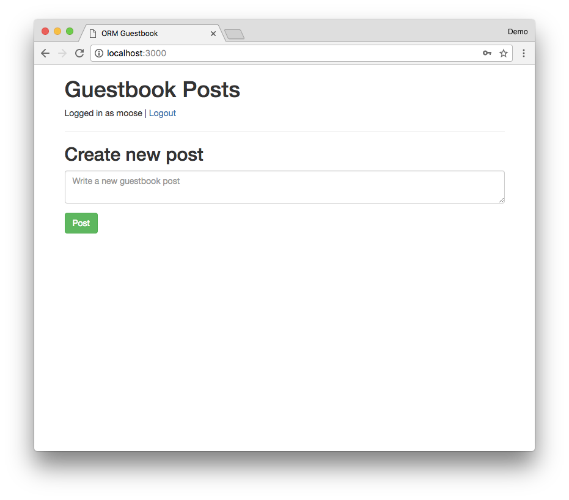
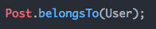

# Self-directed Tutorial and Exercises: Object Relational Mapping

## Intro to Object Relational Mapping

- TODO video

---

## Part 0: Setup

TODO overview, guestbook app

- TODO setup
    - TODO config.js username?

### Exercises

1. TODO
1. Create `models.js`
1. Run `node models.js`

---

## Part 1: Model definitions

TODO

### Exercises

TODO

1. Edit `models.js` and create a `User` model
    1. TODO define schema
1. Run `node sync.js`, connect to your database via pgweb or psql and check
that your table exists and it contains the right columns

    <details><summary>
    Checking tables in `psql`
    </summary><p>

    When using the Postgres command line utility `psql` you can list
    all tables in the current database with the command `\dt`

    ```
    \dt
             List of relations
     Schema | Name  | Type  |  Owner
    --------+-------+-------+----------
     public | animals | table | postgres
    ```

    For a given table, you can check its columns with `\d tablename`

    ```
    \d users
                                   Table "public.users"
      Column   |           Type           |                     Modifiers
    -----------+--------------------------+----------------------------------------------------
     id        | integer                  | not null default nextval('users_id_seq'::regclass)
     username  | character varying(255)   | not null
     password  | character varying(255)   | not null
     createdAt | timestamp with time zone | not null
     updatedAt | timestamp with time zone | not null
    Indexes:
        "users_pkey" PRIMARY KEY, btree (id)
        "users_username_key" UNIQUE CONSTRAINT, btree (username)
    ```

    </p></details>

---

## Part 2: Creating and finding users

### Exercises

1. Edit `auth.js` and implement the `POST /register` endpoint to create a
a new user `req.body.username` and `req.body.password`. If the registration
is successful, redirect to `/login`.

    Export the `User` model from `models.js` and `require()` it into
    `auth.js`.

    TODO docs

1. Run `node app.js` and go to `localhost:3000/register` and register a user.
Check the contents of the `users` table with `psql` or `pgweb` to verify that
the user you registered is present.

1. Edit `auth.js` and finish implementing Passport login functionality
    1. Implement `LocalStrategy` and find a user by using `User.findOne()` and
    specifying a where clause.

        See this
        [example of how we implement `LocalStrategy` with `mongoose`](https://github.com/horizons-school-of-technology/express-template/blob/master/app.js#L67), you'll need to adapt it to use [Sequelize models](http://docs.sequelizejs.com/manual/tutorial/models-usage.html)
    1. Implement `serializeUser()`, call `done()` with `null` as the first
    argument and the user id as the second argument. All `Sequelize` models
    have an `id` (in `mongoose` this field is called `_id`).
    1. Implement `deserializeUser()`, find a user with `User.findById()`
    and call `done()` with `null` as the first argument and the user as
    the second argument.
    1. Restart your server, go to `/login` and login using the user you
    created earlier. You should see:

        <details><summary>
        Screenshot
        </summary><p>

        

        </p></details>

    1. TODO make sure `/` loads out of the box

---

## Part 3: Defining Posts

TODO

### Exercises

1. Edit `models.js` and define a new `Post` model TODO flesh out
    1. TODO schema
1. After you've defined `Post`, create parent-child relationship between
`User` and `Post`, where `Post` is a child of `User`.

    You can use `.belongsTo()` to set up a parent-child relationship between
    User and Post.

    

    This will create a `userId` column on the `Post` model which
    we can later use to find the `User` who wrote each given post.
    Sort of like `.populate()` in `mongoose`.
1. Run `node sync.js` again. This will delete and re-create all your tables.
Verify that the `posts` table has been created in Postgres and that
it contains `userId` column.

    <details><summary>
    Exprected Post schema
    </summary><p>

    ```
        Table "public.posts"
    Column   |           Type           |                     Modifiers
    -----------+--------------------------+----------------------------------------------------
    id        | integer                  | not null default nextval('posts_id_seq'::regclass)
    body      | character varying(255)   | not null
    createdAt | timestamp with time zone | not null
    updatedAt | timestamp with time zone | not null
    userId    | integer                  |
    Indexes:
        "posts_pkey" PRIMARY KEY, btree (id)
    Foreign-key constraints:
        "posts_userId_fkey" FOREIGN KEY ("userId") REFERENCES users(id) ON UPDATE CASCADE ON DELETE SET NULL
    ```

    </p></details>

---

## Part 4: Creating, updating, deleting Posts

TODO

### Exercises

TODO
