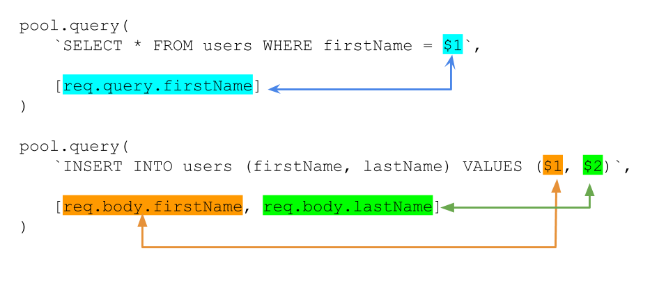

# Self-directed Tutorial and Exercises: Using Postgres in Node

We use the [`pg`](https://node-postgres.com/) NPM package to access
Postgres in Node applications. This is similar to how we use the `mongoose` NPM
package to connect to MongoDB databases in Node.

## Part 0. Get ready

Make sure your local Postgres instance is running and create a new database
called `pg_node`.

Open this folder in your terminal and create an `env.sh` file that sets
the `DATABASE_URL` environment variable:

```sh
export DATABASE_URL="postgresql://localhost/pg_node"
```

---

## Part 1. Connecting

`pg` manages connections to Postgres through [the `pg.Pool` object.](https://node-postgres.com/features/pooling)
Just like with `mongoose.connect()` we need to initialize `pg.Pool` with a connection
string to tell it which database to connect to.

<details><summary>
Aside: Connection pooling
</summary><p>

`pg.Pool` actually creates multiple connections to the database behind
the scenes. This allows our application to handle more requests simultaneously
than a single connection would allow.

This is called connection pooling and is essential to making SQL databases
scale.

</p></details>

---

### Exercise

Edit `pool.js` and establish a connection to Postgres using the
`pg` NPM package. You'll need to use the `pg.Pool` object.


Then run `pool.js` in your terminal to verify that your setup is correct.
You should see:

```
node pool.js
Success, you are connected to Postgres
```

---

## Part 2. Run queries

Once initialized, `pg.Pool` allows us to make queries using the
[query() function](https://node-postgres.com/features/pooling#single-query).

You can use `query()` with callbacks:

```javascript
pool.query('SELECT * FROM users', function(err, result) {
});
```

You can also use `query()` with promises:

```javascript
pool.query('SELECT * FROM users')
.then(function(result) {
})
.catch(function(err) {
});
```

If `query()` is successful, `result` will be a
[`pg.Result` object](https://node-postgres.com/api/result).
You can read the data returned from the database under `result.rows`.

`result.rows` is an array of objects where each object corresponds to a
a row in the database. The row object will contain a key for each column
returned.

For example, say we had a `users` table that contained the following rows:

| firstName | lastName |
| :------------- | :------------- |
| Moose | Paksoy |
| Pam | Needle |
| Prath | Desai |

Then `result.rows` for the query `SELECT * FROM users` would be:

```javascript
[
    {firstName: 'Moose', lastName: 'Paksoy'},
    {firstName: 'Pam', lastName: 'Needle'},
    {firstName: 'Prath', lastName: 'Desai'}
]
```

So if you wanted to read the last name of the 2nd row you could just
do `result.rows[1].lastName`.

### Exercises

Let's use `pg.Pool` to create, populate and read data from a table.

1. Export the `pool` variable in `pool.js`

    ```javascript
    module.exports = pool;
    ```

1. Edit `query.js` and `require()` `pool` from `pool.js`
1. Execute the following SQL queries one after another using promises:
    1. Create an `animals` table that contains 3 columns:
        1. `name`, type `TEXT`
        1. `food`, type `TEXT`
        1. `sound`, type `TEXT`
    1. Insert 3 animals into the animals table:
        1. name: `'donkey'`, food: `'carrots'`, sound: `'hee-haw'`
        1. name: `'cow'`, food: `'grass'`, sound: `'moo'`
        1. name: `'duck'`, food: `'seeds'`, sound: `'quack'`
    1. Get the animal that makes the sound `'moo'` and log its name to the console.

When you run `query.js` in node you should see:

```
node query.js
Success, you are connected to Postgres
The animal name is: cow
```

---

## Part 3. Run queries inside Express

Say we wanted to write a JSON endpoint that returns users from Postgres.

We've already read data from Postgres using `pool.query()` and
`result.rows`. We can simply do that in an Express route:

```javascript
app.get('/users', function(req, res) {
    pool.query('SELECT * FROM users')
        .then(function(result) {
          res.json(result.rows);
        })
        .catch(function (err) {
          res.status(400).json({error: err});
        });
});
```

Now `GET /users` would return our users as a JSON array:

```json
[
  {
    "firstName": "Moose",
    "lastName": "Paksoy"
  },
  {
    "firstName": "Pam",
    "lastName": "Needle"
  },
  {
    "firstName": "Prath",
    "lastName": "Desai"
  }
]
```

### Exercises

Edit `server.js` and create your own routes to modify the `animals` table.

1. `require()` `pool` into `server.js`
1. Create a `GET /animals` route that returns only the `name` and `sound` of
each animal in the `animals` table **in increasing name order** as JSON.

    <details><summary>
    Expected output
    </summary><p>

    ```json
    [
        {
            "name": "cow",
            "sound": "moo"
        },
        {
            "name": "donkey",
            "sound": "hee-haw"
        },
        {
            "name": "duck",
            "sound": "seeds"
        }
    ]
    ```

    </p></details>

1. Create a `POST /delete/donkey` that deletes the animal named `donkey`
from the table `animals`. It should respond with JSON
`{ "success": true}` if deletion is successful.

    Use the `GET /animals` route to validate that `donkey` is deleted.

---

## Part 4. Dynamic queries

### ☠ SQL Injection ☠

The queries we've written so far are *static*, meaning they can't change behavior
based on user input.

Let's say we wanted to change our `GET /users` endpoint to be able to handle
the request `/users?firstName=moose` and only return rows where `firstName`
is `moose`. You could be tempted to do this:

```
// ☠ Don't do this ☠
app.get('/users', function(req, res) {
    pool.query(`SELECT * FROM users WHERE firstName = '${req.query.firstName}'`)
        .then(function(result) {
          res.json(result.rows);
        })
        .catch(function (err) {
          res.status(400).json({error: err});
        });
});
// ☠ Don't do this ☠
```

If someone were to set `req.query.firstName` to `"' OR 1 = 1 --"`
our query would become:

```
SELECT * FROM users WHERE firstName = '' OR 1 = 1 --'
```

This query would return all rows instead of just ones matching given `firstName`.
(`--` is how you comment things out in SQL, everything after that is ignored,
like `//` in JavaScript.)

This attack, generating specially crafted user input to alter query behavior,
is called [SQL Injection](https://www.w3schools.com/sql/sql_injection.asp).
It can lead to very [severe vulnerabilities](https://xkcd.com/327/).

### Parameterized queries

The `pg` NPM package offers built-in protection against SQL Injection attacks
in the form of Parameterized Queries.
[See documentation for parameterized queries.](https://node-postgres.com/features/queries#parameterized-query)

To use parametrized queries we put placeholders into our queries and then
pass user provided input in a separate array. `pg` then safely inserts
user provided input into the query.

So instead of doing this:

```javascript
// BAD ❌
pool.query(`SELECT * FROM users WHERE firstName = ${req.query.firstName}`)
```

We do this:

```javascript
// Good ✅
pool.query(`SELECT * FROM users WHERE firstName = $1`, [req.query.firstName])
```

`$1` is a placeholder that maps to the first item in the array.
You can pass in more than one argument in the array by using `$2`, `$3`, and
so forth.



Now we can safely implement `GET /users` to take a `firstName` query
parameter:  

```javascript
app.get('/users', function(req, res) {
    pool.query(`SELECT * FROM users WHERE firstName = $1`, [req.query.firstName])
        .then(function(result) {
          res.json(result.rows);
        })
        .catch(function (err) {
          res.status(400).json({error: err});
        });
});
```

### Exercises

Let's implement some endpoints that make queries against Postgres
using `req.query`, `req.body`, and `req.params`.

1. Update the `GET /animals` route to to take an optional `name` argument
through `req.query`. If `name` is not specified, return all animals,
otherwise only return animals that match given name.

    Making a `GET` request to `/animals` should still return all animals.

    Making a `GET` request to `/animals?name=cow` should return only the humble cow:

    ```json
    [
        {
            "name": "cow",
            "sound": "moo"
        }
    ]
    ```

1. Update the `POST /delete/donkey` endpoint so that it can receive a `name`
argument through `req.params`.

    Making a `POST` request to `/delete/duck` should delete the duck and
    `/delete/cow` should delete the cow.

    Use the `/animals` endpoint to verify deletion.

1. Create a `POST /create` endpoint that inserts a new animal by reading
`name`, `food`, `sound` from `req.body`. Respond with `{"success": true}`
if insertion is successful.

    Insert 3 animals and read them back using `/animals`
